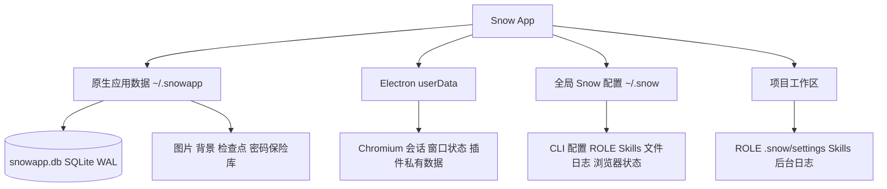

# 数据存储位置参考

> 本文档依据 `native/src/storage/` 与 `src/main/` 的当前实现整理 Snow App 的主要持久化位置、生命周期、安全边界以及正确的备份与恢复方式。`~` 表示当前操作系统用户的主目录。

## 存储架构总览

这些层并非彼此替代：数据库保存索引和结构化记录，资源目录保存二进制文件，Electron `userData` 保存运行时浏览器数据和主进程文件，`~/.snow/` 与工作区保存 CLI/规则/项目范围文件。

## 1. 原生应用数据：`~/.snowapp/`

`native/src/storage/paths.rs` 通过用户主目录解析 `<home>/.snowapp`。该目录同时包含主数据库和由应用管理的资源。

### 1.1 主数据库：`~/.snowapp/snowapp.db`

数据库使用 SQLite（rusqlite），连接启用：

- WAL journal mode；
- `synchronous=NORMAL`；
- foreign keys；
- 5 秒 busy timeout。

代表性表如下：

| 表                                                        | 内容与敏感性                                                                                                                    |
| --------------------------------------------------------- | ------------------------------------------------------------------------------------------------------------------------------- |
| `system_settings`                                         | 主题、语言、快捷键、隐私、请求日志开关、图库根目录等键值设置                                                                    |
| `api_configs`                                             | API profile、密钥与模型配置；高度敏感                                                                                           |
| `system_prompts`                                          | 全局/项目系统提示词模板                                                                                                         |
| `custom_header_schemes`                                   | 自定义请求头方案，可能含令牌                                                                                                    |
| `workspace_directories`                                   | 工作区列表                                                                                                                      |
| `mcp_server_configs`                                      | 全局 MCP 配置                                                                                                                   |
| `lsp_server_configs`                                      | LSP 语言服务器配置（DB-backed `lsp-config` 域；旧 `~/.snow/lsp-config.json` 已迁移并入）                                        |
| `system_settings`（键前缀 `project_lsp_server_configs_`） | 项目级 LSP 配置（Phase 3：按项目覆盖全局同语言，照 project_mcp_server_configs 模式）                                            |
| `plugins` / `plugin_marketplaces` / `plugin_components`   | 插件元数据、市场和组件注册                                                                                                      |
| `chat_conversations` / `chat_messages`                    | 会话与消息，包括资源引用                                                                                                        |
| `sub_agent_sessions` / `sub_agent_configs`                | 子代理会话与配置                                                                                                                |
| `todo_items` / `memos`                                    | TODO 与备忘录                                                                                                                   |
| `project_memories`                                        | 项目级持久记忆（跨会话 AI 知识库，按 `directory_id` 项目隔离、`conversation_id` 溯源到来源会话）                                |
| `usage_records`                                           | token 用量、状态、模型和项目关联                                                                                                |
| `userscripts` / `userscript_values`                       | 内置浏览器油猴兼容用户脚本元数据与 `GM_*` 持久化值；脚本源码文件另存于 `~/.snowapp/browser-script/`，非敏感但可能含凭据型 GM 值 |
| `app_logs`                                                | 系统日志和可选的原始 API 请求 payload                                                                                           |
| `image_library`                                           | 图库索引；实际图片位于默认或自定义根目录                                                                                        |
| `codebase_embed_sessions` / `codebase_embeddings_*`       | 代码库嵌入状态与按项目动态创建的向量表                                                                                          |

数据库备份应按敏感数据处理，因为单个文件可同时包含凭据、提示词、用户消息、日志和项目路径。

### 1.2 Schema、迁移与版本

当前源码将 `PRAGMA user_version` 设置为 26。初始化顺序为：

1. 执行 pre-schema migrations；
2. 执行 `CREATE TABLE IF NOT EXISTS`；
3. 执行 post-schema migrations；
4. 更新 `user_version`。

pre-schema 阶段用于不兼容表重建，post-schema 阶段用于幂等加列、索引和数据修补。源码也保留一个针对旧开发期 `INTEGER PRIMARY KEY` schema 的破坏性重建路径，因此不能承诺所有历史升级都无损。升级前必须备份。

### 1.3 损坏数据库恢复

检测到 `DatabaseCorrupt`、`NotADatabase`、`malformed` 等错误时，应用会尽力恢复：

1. 创建 `snowapp.db.recovered` 和当前 schema；
2. 从损坏库逐表逐行复制仍可读取的数据；
3. 跳过无法读取或插入的行；
4. 执行 post-schema migrations；
5. 删除旧 WAL/SHM sidecar；
6. 把原库重命名为 `snowapp.db.corrupt.<unix_timestamp>.bak`；
7. 原子地用 recovered 文件替换正式库。

自动恢复不保证所有行都能恢复。发现 `.corrupt.*.bak` 后应保留该文件，先检查关键会话、凭据和设置是否完整，再决定是否清理。

除自动恢复外，**设置 → 通用设置**中提供「修复数据库」按钮（运行库/归档库分别可点），可手动触发同样的逐表恢复流程；修复前应确认当前没有重要写入操作。

### 1.4 应用资源目录

| 路径                              | 内容                                                        | 生命周期与边界                                                                 |
| --------------------------------- | ----------------------------------------------------------- | ------------------------------------------------------------------------------ |
| `~/.snowapp/checkpoints/`         | 会话文件变更检查点                                          | 保存用户文件快照；扫描排除 `.snow` / `.snowapp`                                |
| `~/.snowapp/backgrounds/`         | 复制后的主题背景                                            | 删除原始图片不影响副本；删除副本会使主题资源失效                               |
| `~/.snowapp/stream-cursors/`      | 自定义流式光标 SVG                                          | 由受控主题资源链路读取                                                         |
| `~/.snowapp/upload/<YYYY-MM-DD>/` | 聊天内联图片 `<hash>.<ext>`                                 | 消息只保存相对引用；仅备份数据库会丢图                                         |
| `~/.snowapp/image/`               | 默认图库根目录                                              | 可改为自定义目录；图片与数据库索引必须一起备份                                 |
| `~/.snowapp/workspace/`           | 内置默认工作目录                                            | 无用户工作区时供会话挂载                                                       |
| `~/.snowapp/browser-passwords/`   | 浏览器密码保险库                                            | OS 绑定加密；见下节                                                            |
| `~/.snowapp/browser-script/`      | 内置浏览器油猴兼容用户脚本源码文件（`{script_id}.user.js`） | 元数据存 SQLite `userscripts` 表，此处只存源码原文；脚本删除时最佳努力删除文件 |

**存储用量显示**：设置 → 通用设置的存储位置区域会显示各路径的占用大小（运行库、归档库、checkpoint、上传图片、图库等，通过 `get_path_size` 计算）；路径不存在或读取失败时不显示。

## 2. 浏览器密码与登录态

### 2.1 密码保险库：`~/.snowapp/browser-passwords/`

密码保险库采用两层保护：

- `vault.key`：每次安装生成随机 32 字节 AES-256 主密钥，再由 Electron `safeStorage` 包装；后端对应 macOS Keychain、Windows DPAPI 或 Linux 密钥环；
- `vault.bin`：全部密码记录用 AES-256-GCM 加密，使用随机 12 字节 IV 和 16 字节认证 tag。

文件权限会尝试设为 `0600`，更新通过 `vault.bin.tmp` 后 rename 原子替换。`safeStorage` 不可用时，应用拒绝明文持久化。

列表 API 不返回密码；只有按 ID 查看或同源自动填充时才解密。自动填充 IPC 校验 sender frame origin，拒绝跨源读取。

> `safeStorage` 与 OS 用户/安装环境绑定。跨机器只复制 `vault.key` 和 `vault.bin` 不保证可解密。密钥缺失或不可解密时会生成新密钥；损坏或密钥不匹配的旧 vault 返回空库，但原文件会保留而不会被主动覆盖。

### 2.2 实时浏览器会话

内置浏览器 webContents 的 cookies 通过其 Electron session 管理，Chromium 会话数据属于 Electron `userData` 边界。具体底层文件名和子目录由 Electron/Chromium 版本及平台控制，本文不写死 `Cookies` 路径。

清除浏览器数据与导出登录态是不同操作。浏览器运行时数据可能包含认证 Cookie，应在备份、共享或清理整个 `userData` 前退出应用。

### 2.3 导出的登录态：`~/.snow/browser-state/`

导出文件包含当前 webContents 的 cookies 和主 frame 同源 localStorage：

- 整个文件由 `safeStorage` 加密，权限尝试设为 `0600`；
- `safeStorage` 不可用时拒绝明文保存；
- 文件名只允许 `[A-Za-z0-9._-]{1,100}`；
- 文件含 `SNOWSTATE` magic、版本号和 schema 校验；
- 默认文件名类似 `state-<ISO时间>.bin`；
- 损坏、伪造、错误 OS 用户或被修改的文件会拒绝恢复。

恢复前，如果当前浏览器已有 cookies/localStorage，会把同样加密的备份写入 `~/.snow/browser-state/backups/`。localStorage 只注入匹配 origin；调试协议不可用时仍可恢复 cookies。

## 3. 图库与自定义目录

默认图库根是 `~/.snowapp/image/`，自定义根保存在 SQLite `system_settings.image_library_dir`。图片物理路径为 `<root>/<YYYY-MM-DD>/<file>`，而 `image_library.relative_path` 始终使用 `image/...` 逻辑前缀，即使物理根已自定义。

图库根目录的切换、重置与迁移入口位于 **设置 → 通用设置** 的存储位置区域（与 checkpoint / 上传目录并列，并显示各目录占用大小）；图像库面板只保留浏览与相册功能。

自定义目录不可创建时，读取路径会回退默认目录。更换目录采用可恢复迁移：

1. prepare 在 `~/.snowapp/` 写迁移 journal；
2. 每批最多 16 个文件复制到新根，并持续记录已复制项；
3. commit 更新 `image_library_dir`，然后清理旧根文件；
4. 取消或复制失败时，rollback 删除新根副本；
5. 启动时发现中断 journal：未提交则回滚，已提交则完成清理。

源文件在 commit 前保留，因此该过程不是直接移动。不要在迁移进行中手工删除任一根目录。删除图库图片时，应用先在事务中重写会话引用并删除索引，再尽力删除物理文件；删除会话时可选择是否级联删除引用图片。

## 4. Electron `userData`

典型位置由 Electron 平台规则和应用名 `Snow App` 决定：

| 平台    | 典型 `userData`                           |
| ------- | ----------------------------------------- |
| Windows | `%APPDATA%\Snow App\`                     |
| macOS   | `~/Library/Application Support/Snow App/` |
| Linux   | `~/.config/Snow App/`                     |

已明确由应用写入的内容包括：

| 路径                           | 内容                                         |
| ------------------------------ | -------------------------------------------- |
| `<userData>/window-state.json` | 窗口位置、尺寸和最大化状态                   |
| `<userData>/ssh-credentials`   | SSH 凭据存储                                 |
| `<userData>/plugins/<hash>/`   | 插件运行时私有存储                           |
| Electron/Chromium 管理的子目录 | 实时 session、Cookie、缓存等；具体结构不稳定 |

### 4.1 插件隔离存储

每个插件的私有目录为 `<userData>/plugins/<sha256(pluginId) 前 24 位>/`。路径通过 `SNOW_PLUGIN_STORAGE_PATH` 传入插件，utility process 的 cwd 也设为该目录。只有声明 `storage` 权限的插件才允许读写自己的目录；`network` 和 `child-process` 权限分别控制网络和子进程能力。

插件相关数据分散在四处：

| 类型           | 位置                                                         |
| -------------- | ------------------------------------------------------------ |
| 元数据         | SQLite `plugins`、`plugin_marketplaces`、`plugin_components` |
| 市场缓存       | `~/.snow/plugin-marketplaces/`                               |
| 市场安装本体   | `~/.snow/plugins/marketplaces/`                              |
| 运行时私有数据 | `<userData>/plugins/<hash>/`                                 |

停用或停止插件不等于删除私有存储。源码未提供“卸载必定清理该目录”的保证，备份和清理时应分别处理。

### 4.2 更新缓存的平台差异

macOS 自定义更新器使用：

- `<userData>/updates/latest-mac.json`；
- `<userData>/updates/snow-app-update-<version>-<arch>.zip`；
- `<userData>/updates/install-update.sh`；
- `app.getPath("logs")/updater.log`。

非 macOS 平台使用 `electron-updater`，下载缓存由该库和平台管理，位置可能随平台及库版本变化，不能统一写成 `<userData>/updates/`。更新状态本身只在进程内保存，不是持久化配置。

## 5. 全局 Snow 配置：`~/.snow/`

该目录与 Snow CLI/config 工具共享。主要内容包括：

| 路径                                             | 内容与边界                                                       |
| ------------------------------------------------ | ---------------------------------------------------------------- |
| `settings.json`                                  | 全局设置；项目设置可在工作区覆盖                                 |
| `config.json`                                    | `snowcfg` API/模型配置，可能含密钥                               |
| `proxy-config.json`                              | 代理、搜索引擎与浏览器配置                                       |
| `active-profile.json`                            | 当前活动 profile                                                 |
| `custom-headers.json`                            | CLI 自定义请求头同步源，可能含秘密                               |
| `system-prompt.json`                             | CLI 系统提示词同步源                                             |
| `theme.json` / `language.json`                   | config 工具的主题与语言域；不是当前 UI SQLite 设置的唯一事实来源 |
| `permissions.json`                               | 工具免确认白名单                                                 |
| `lsp-config.json` / `buddy.json`                 | LSP 与 Buddy 配置                                                |
| `ROLE.md`                                        | 全局个性化规则                                                   |
| `skills/` / `skills-registry.json`               | 全局 Skills 与注册信息                                           |
| `docs/`                                          | 内置文档同步副本                                                 |
| `plugin-marketplaces/` / `plugins/marketplaces/` | 插件市场缓存与安装本体                                           |
| `browser-state/`                                 | 加密导出登录态及恢复前备份                                       |
| `log/`                                           | config `logs` scope 的按日分级文件日志                           |
| `.config-backups/`                               | config 工具写入前的临时安全网；成功写入后清理                    |

## 6. 项目工作区

| 路径                              | 内容                                        |
| --------------------------------- | ------------------------------------------- |
| `<workspace>/ROLE.md`             | 当前项目规则                                |
| `<workspace>/.snow/settings.json` | 项目设置，包括 `role.includeGlobalRules` 等 |
| `<workspace>/.snow/skills/`       | 项目级 Skills                               |
| `<workspace>/.snow/logs/`         | bash `detach:true` 后台任务 stdout/stderr   |

`.snow` 通常被 Git 忽略，也被 checkpoint 扫描与 SSH 文件遍历排除。项目目录可能包含独立敏感信息，不应因为被忽略就视为安全备份。

## 7. 三类日志不可混用

| 日志源          | 位置                      | 清理行为                                     |
| --------------- | ------------------------- | -------------------------------------------- |
| 设置页系统日志  | SQLite `app_logs`         | UI 两步确认后删除整表日志                    |
| config 文件日志 | `~/.snow/log/`            | `config-delete` 经明确确认后删除一个精确文件 |
| 后台任务日志    | `<workspace>/.snow/logs/` | 独立工作区文件，不受前两者影响               |

原始 API 请求日志写入第一类，可能含完整请求 payload。三类日志都必须在分享前脱敏。

## 8. 生命周期与删除边界

| 数据                   | 默认生命周期                                   | 关键删除/恢复边界                                    |
| ---------------------- | ---------------------------------------------- | ---------------------------------------------------- |
| SQLite 业务数据        | 持续保留，直到 UI 操作、迁移、恢复或数据库替换 | WAL 模式下不要运行时只复制/替换单个 DB 文件          |
| `usage_records`        | 未定义自动保留期                               | 当前用量页无清空入口                                 |
| `app_logs`             | 未定义自动轮换                                 | 清空删除全部 SQLite 日志，不受当前筛选限制           |
| 上传图片与图库文件     | 随资源目录保留                                 | 数据库索引与物理文件必须一致；会话删除可选择级联图片 |
| 主题资源               | 复制后由应用管理                               | 删除原始文件不影响副本；删除副本会破坏引用           |
| 密码保险库与浏览器状态 | 保留到用户删除或目录被替换                     | 加密与 OS 用户绑定，跨机复制不保证可恢复             |
| 插件私有数据           | 停用/停止后仍可能保留                          | 不应假设卸载一定清理                                 |
| 更新缓存               | 由更新流程/库管理                              | 平台位置和清理策略不同                               |
| 配置备份               | config 写入期间的临时安全网                    | 不是长期备份方案                                     |

## 9. 安全边界

- `snowapp.db`、`~/.snow/config.json`、自定义请求头、请求日志和 SSH 凭据都可能包含秘密。
- `safeStorage` 保护的文件依赖当前 OS 用户及密钥后端；它们不是可随意跨机解密的便携备份。
- localStorage、cookies 和密码仅应在可信设备和可信用户账户下恢复。
- 插件私有目录是权限边界，不要把一个插件的数据复制给另一个插件。
- 文件权限 `0600` 是尽力设置；Windows 的实际保护依赖账户 ACL 与 DPAPI。
- 分享日志、数据库或目录清单前，应移除 API key、Authorization、Cookie、提示词、用户内容、路径和内网地址。

## 10. 正确备份与恢复

### 备份

1. 完全退出 Snow App，确保数据库不再写入。
2. 备份整个 `~/.snowapp/`，而不是只复制 `snowapp.db`；这同时覆盖 WAL/SHM sidecar、上传、默认图库、背景、检查点和密码保险库。
3. 若图库使用自定义根目录，单独备份该根目录。
4. 备份 `~/.snow/`，并按敏感数据保护其中的密钥、ROLE、Skills、浏览器状态和日志。
5. 按需备份 Electron `userData`，尤其是插件私有数据和实时浏览器会话。
6. 备份需要保留的工作区 `ROLE.md`、`.snow/settings.json`、项目 Skills 和后台日志。

### 恢复

1. 在目标环境完全退出 Snow App。
2. 保留目标环境现有目录的副本，避免覆盖后无法回退。
3. 恢复 `~/.snowapp/`、`~/.snow/`、所需 `userData` 与自定义图库根。
4. 启动应用，让 schema 迁移与中断图库迁移恢复逻辑运行。
5. 检查会话、图片、API profile、插件和用量记录。
6. 单独验证密码保险库和浏览器登录态；跨 OS 用户或跨机器时，它们可能因 `safeStorage` 绑定而无法解密。

> 不要在 Snow App 运行时直接替换 `snowapp.db`，也不要只恢复数据库却遗漏 `upload/`、图库根或其他被消息引用的资源。
