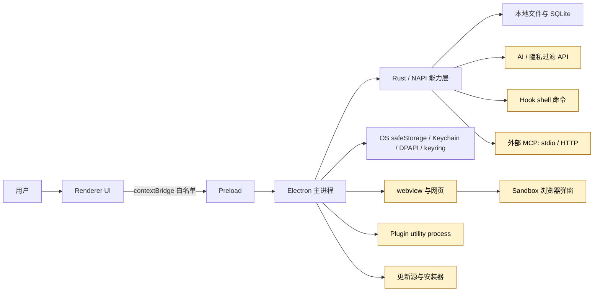

# 5-安全与信任边界参考

本文给出 Snow App 的安全架构、信任域、控制点和残余风险参考。它用于判断“数据在哪里解密”“谁能触发副作用”“哪些隔离不能等同于信任”，而不是替代具体组织的威胁建模、终端防护、备份和访问控制。

## 1. 威胁模型与非目标

Snow 需要处理以下高价值对象：

- API Key、密码、Cookie、localStorage 与 OAuth 会话；
- 源代码、项目文件、终端命令和数据库/网络访问；
- AI 上下文、工具参数/结果、Hook 输出与日志；
- Plugin、Skill、子代理和外部 MCP 提供的代码或指令；
- 应用更新 manifest、包、缓存和安装脚本。

主要风险包括恶意或被攻陷的网页/扩展/服务、提示注入、错误授权、供应链篡改、已解锁本机账户被控制，以及备份/迁移时误判加密文件的可移植性。

Snow 的客户端控制不是以下事项的完整解决方案：恶意 OS 管理员、内核级恶意软件、已解锁用户会话完全失陷、外部服务内部治理、发布账户安全、社会工程或所有未知命令变体。

## 2. 信任域总览

每条箭头都是需要验证身份、参数、数据最小化和失败行为的边界。进程隔离、加密或授权通常只解决其中一个维度，不能自动解决来源可信度和业务正确性。

## 3. Electron 窗口边界

| 组件 | 配置/行为 | 安全含义 | 残余风险 |
| --- | --- | --- | --- |
| 主窗口 | `contextIsolation: true`、`nodeIntegration: false`、`sandbox: false`、`webviewTag: true` | renderer 不能直接调用 Node；原生能力经 preload/contextBridge | 主窗口本身非 sandbox；桥接 API、XSS 和 webview 编排仍需最小权限 |
| 主窗口外链 | `window.open` 被拒绝，交给 `shell.openExternal` | 避免在普通子窗口中继承 Snow 能力 | 系统浏览器及目标站点仍是外部信任方 |
| webview guest | 加载远程页面并使用浏览器 session | 网页与 Snow UI 分离 | 网页内容、提示注入、Cookie 和下载仍有风险 |
| OAuth/网页弹窗 | `sandbox: true`、`contextIsolation: true`、`nodeIntegration: false` | 限制弹窗直接使用 Node | 与 opener 共享 session/Cookie，保留 `window.opener`/`postMessage` |

弹窗可递归创建下一层弹窗并复用同一策略；主窗口关闭时统一清理。必须准确区分“浏览器弹窗 sandbox”和“主窗口非 sandbox”。

## 4. 本地存储与 OS 凭据边界

### 4.1 密码保险库

| 层 | 实现 |
| --- | --- |
| 文件 | `~/.snowapp/browser-passwords/vault.key`、`vault.bin` |
| 主密钥 | 随机 32 字节，使用 Electron `safeStorage` 包装 |
| OS 后端 | macOS Keychain、Windows DPAPI、Linux keyring |
| 数据加密 | AES-256-GCM；12 字节 IV、16 字节认证 tag、密文 |
| 写入 | 临时文件 + `rename` 原子替换，尽力设置 `0600` |
| 失败 | `safeStorage` 不可用时拒绝保存，不写明文 |

列表不返回密码明文；只有按 ID 显示或按 origin 自动填充时解密。自动填充 IPC 校验 sender frame origin，避免网页请求其他 origin 的凭据。

### 4.2 登录态存档

`~/.snow/browser-state/` 保存 Cookie 与当前主 frame origin 的 localStorage，并由 `safeStorage` 整体加密；恢复前在 `backups/` 备份。magic header、版本、schema、文件名白名单和完全匹配 origin 的 localStorage 注入用于降低格式混淆和跨源恢复风险。

### 4.3 边界

OS 安全存储绑定当前 OS 用户环境，不是可跨机通用密钥封装。复制 `vault.bin`、`vault.key` 或登录态文件到另一机器/用户通常不能解密。已解锁账户被控制时，攻击者仍可能调用应用解密路径；磁盘加密、会话锁定和端点防护仍必需。

存储目录详见 [数据存储位置](4-数据存储位置.md)，使用说明见 [浏览器设置、密码与数据导入](../2-使用指南/17-浏览器设置密码与数据导入.md)。

## 5. AI、工具与授权边界

| 控制 | 作用域 | 提供的保护 | 不保证 |
| --- | --- | --- | --- |
| 逐次授权 | 单个工具调用 | 用户可批准本次或拒绝 | 用户一定理解参数；外部实现安全 |
| 项目永久授权 | 当前 `directoryId` + 工具名 | 降低重复确认且不跨项目 | 每次参数安全；持久化失败回滚当前批准 |
| YOLO | 持久化全局设置 | 普通工具自动批准 | 绕过敏感命令、Hook、Plan/Rust 闸门 |
| 敏感命令 | 全局/项目有效正则 | 命中 Bash 命令时强制确认和一次性令牌 | 捕获未覆盖、编码或间接危险命令 |
| Plan Mode | 当前会话 | 未批准时 Rust 阻断普通 create/replace 写入 | 所有工具副作用的完整 sandbox |
| 子代理白名单 | 子代理调用 | 限定可调用工具集合 | 已允许工具的业务安全 |

敏感命令令牌绑定完整命令，有效约 60 秒且单次消费。格式错误的正则被跳过；交互式命令依赖交互终端确认。YOLO 仅自动批准非敏感项。

Plan Mode 的 `planMode` / `planApproved` 传入 Rust 工具执行层。批准前只允许 `.snow/plan` 或 `.trellis/tasks` 的计划文档写入；普通 `filesystem-create` / `filesystem-replace_edit` 被阻断。子代理不能为主会话自行授予 Plan 批准。批准后仍需其他授权和审查。

## 6. 隐私过滤边界

隐私过滤默认关闭，只处理设置中选定的工具结果。它不是聊天、文件系统、网页和网络的全局 DLP。

| 模式 | 数据路径 | 失败行为 | 新信任方 |
| --- | --- | --- | --- |
| 本地 | Rust 正则/校验后再跨 NAPI | 规则可能误报/漏报；极少数后台任务失败可返回原文 | 无外部服务 |
| API | 待处理文本发送到配置 HTTP API，期望 `masked_text` | 任意 API 错误回退本地规则 | API 运营者、网络和认证配置 |

本地规则包括私钥、JWT、常见 API Key、Authorization、URL token、身份证和支付卡等。API 模式可能同时发送 `x-api-key` 和 Bearer 头。即使有回退，发送前的原文已经到达 API 端点，因此应优先做数据最小化。

## 7. 浏览器与登录态边界

远程网页不可信。网页可读取自身 origin 可见的数据、发起网络请求并尝试诱导用户或 AI。Snow 的 origin 检查限制密码跨源查询，但以下数据仍具高风险：

- Cookie 导入直接写入 `defaultSession`，可能立即登录账户；
- OAuth 弹窗与 opener 共享 Cookie/session；
- localStorage 恢复只匹配 origin，但该 origin 的网页脚本随后可读取；
- Cookie 列表默认掩码，但显式 `showValues=true` 会返回明文；
- 导入和状态恢复不是持续同步或账户撤销机制。

本机浏览器导入会读取源 profile。Windows Chromium 使用 DPAPI + AES-256-GCM，macOS 使用 Keychain/PBKDF2/AES-128-CBC；Linux 当前不能取得 GNOME Keyring/KWallet 中的 Chromium 密钥。Firefox 使用 NSS 相关 3DES，主密码需先处理。数据库锁、WAL、版本差异和 Cookie 约束会产生部分失败。

## 8. Plugin、Hook、Skill、MCP 与子代理

| 扩展面 | 执行/来源 | 关键风险 | 建议 |
| --- | --- | --- | --- |
| 声明式 Plugin | 市场声明组件，不执行安装脚本 | 恶意配置、来源和更新风险 | 只安装可信发布者内容 |
| 外部 Plugin | 隔离 utility process，启动前风险确认 | 隔离不等于可信；可滥用已授权限 | 审查代码、权限和更新 |
| Hook | shell 命令、上下文、prompt | 本地代码执行、上下文注入、流程影响 | 固定依赖、最小权限、记录输出 |
| Skill | 给 Agent 的流程/知识指令 | 可诱导扩大工具调用或数据范围 | 阅读来源和正文，避免盲目启用 |
| 外部 MCP | stdio 本地进程或 HTTP 服务 | 任意外部副作用、数据保留、伪导工具描述 | 限定工具、端点和凭据，单独审计 |
| 子代理 | 独立 Agent 循环 + 工具白名单 | 上下文误配、已允许工具的副作用 | 提供最小上下文和明确文件所有权 |

Hook 退出码 0 通过、1 警告/可选决策、2+ 阻断；`onStop`、`onSessionStart` 等 fire-and-forget 节点不能真正阻断，决策会降级为 warning。工具授权只控制 Snow 的调用入口，不证明 Plugin/Hook/MCP 的内部安全。

参阅 [配置 Hooks 与子代理](../2-使用指南/5-配置Hooks与子代理.md) 与 [配置 MCP 服务器](../2-使用指南/1-配置MCP服务器.md)。

## 9. 更新供应链边界

### Windows/Linux

使用 `electron-updater`，关闭自动下载与普通退出自动安装，由用户触发下载和 `quitAndInstall()`。签名、仓库权限和资产发布策略属于发行配置边界，不能仅从客户端事件流得出保证。

### macOS

使用无签名全量 ZIP 自替换：默认从 GitHub release manifest 获取 `version`、架构 URL、SHA256 和可选 size；校验 `content-length`、size 与 Rust 计算的 SHA256；缓存通过哈希复用。安装脚本等待旧进程、删除旧 `.app`、解压、`xattr -cr` 并 `open` 新版本。

该模型主要信任 HTTPS、manifest 来源、发布账户和 SHA256。若 manifest 可被同时篡改，SHA256 无法提供真实性。`updater.log`、缓存和脚本提供排障证据，但无签名更新仍弱于代码签名/公证链路。

完整流程见 [应用更新](../2-使用指南/18-应用更新.md)。

## 10. 用户责任与残余风险

1. 对工具参数、路径、命令和外部端点做人工确认。
2. 将 YOLO、项目永久授权和扩展权限保持在最小范围。
3. 只向可信 AI/API/MCP/Plugin/Hook 提供任务所需数据。
4. 使用 OS 锁屏、磁盘加密、恶意软件防护和独立备份。
5. 导入 Cookie 后核对登录会话，丢失设备时从服务端撤销。
6. 保护 GitHub 发布账户、manifest 和组织代理基础设施。
7. 不把隐私过滤、sandbox、utility process 或 AES-GCM 当作端到端安全证明。

## 11. 安全事件响应建议

发现异常工具执行、凭据泄露、可疑扩展或更新篡改时：

1. 停止相关会话，关闭 YOLO，禁用可疑 Hook/Plugin/MCP；
2. 断开网络或隔离设备，同时保留必要日志和时间线；
3. 从服务端撤销 Cookie/OAuth 会话并轮换 API Key、密码和令牌；
4. 检查项目授权、敏感命令规则、Hook 输出和工具调用记录；
5. 对更新事件保存 manifest、ZIP 哈希、缓存、脚本和 `updater.log`；
6. 从可信备份或发行源恢复，避免用未验证文件覆盖证据；
7. 分析根因并收紧最小权限、监控与发布流程。

面向日常操作的设置步骤见 [安全、隐私与工具授权](../2-使用指南/16-安全隐私与工具授权.md)。
