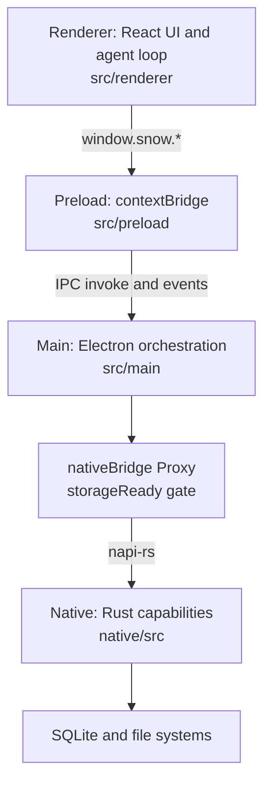
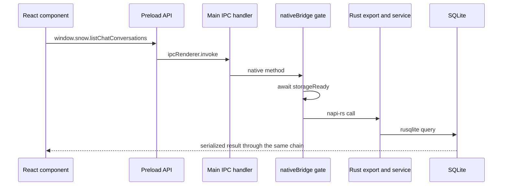
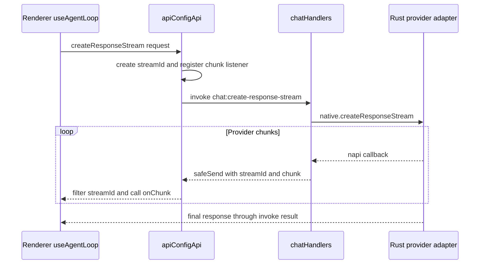
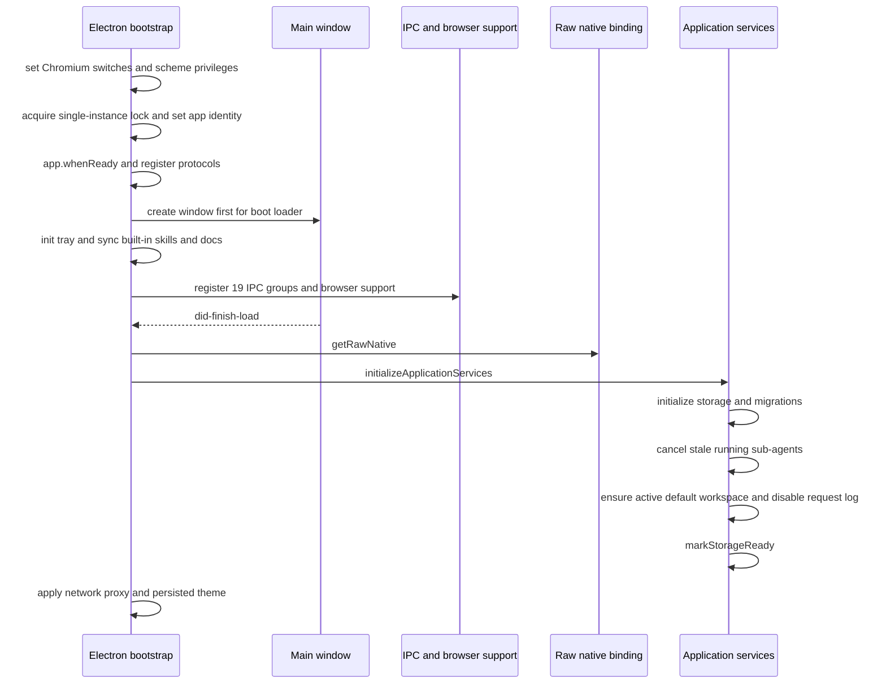
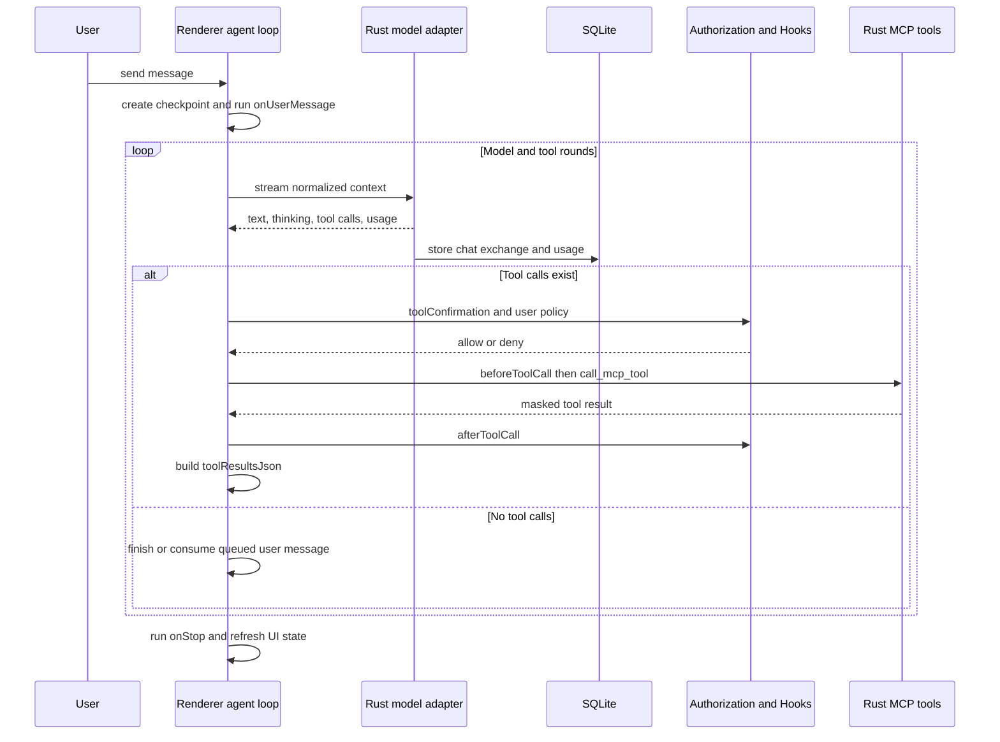

# 架构总览

> 面向开发者：Snow App 的分层职责、通信边界、启动顺序与一次 AI 运行的主链路。
> 延伸阅读：[Agent 运行时与工具编排](4-Agent运行时与工具编排.md)、[存储迁移备份与恢复](5-存储迁移备份与恢复.md)、[功能模块架构与数据流图集](6-功能模块架构与数据流图集.md)。

## 1. 技术栈

| 层       | 技术                                   | 主要职责                                              |
| -------- | -------------------------------------- | ----------------------------------------------------- |
| Renderer | React 19、TypeScript、Vite             | UI、会话状态、主 Agent loop、授权交互                 |
| Preload  | Electron contextBridge                 | 将 16 个 API 对象展开为受控的 `window.snow.*`         |
| Main     | Electron 37、TypeScript                | 生命周期、IPC 编排、窗口、PTY/SSH、浏览器、插件、更新 |
| Native   | Rust、napi-rs、Tokio                   | 模型适配、MCP、SQLite、checkpoint、代码库索引         |
| Storage  | SQLite、文件系统                       | `~/.snowapp/snowapp.db`、资源文件及多配置域           |
| Build    | electron-vite、Cargo、electron-builder | 三入口打包及平台原生 `.node`                          |

## 2. 分层架构

- Renderer 无 Node 权限；系统能力只能经 preload 白名单 API。
- Main 负责 Electron 资源和跨层编排，不直接持有 SQLite 连接。
- Rust 负责 provider 流、MCP 执行、持久化及文件 checkpoint。
- 主 Agent 状态机位于 Renderer 的 `useAgentLoop.ts`；`native/src/exports/engine.rs` 是能力导出之一，不是完整循环的唯一实现。

## 3. 通信链路

### 3.1 普通请求：Renderer 到存储

`src/preload/index.ts` 当前组合 **17 个扁平 API 对象**：`apiConfigApi`、`configApi`、`conversationApi`、`workspaceApi`、`sshApi`、`gitApi`、`systemApi`、`ptyApi`、`windowApi`、`memoApi`、`memoryApi`、`personalizationApi`、`codexApi`、`importConfigApi`、`pluginsApi`、`imageLibraryApi` 和 `ideApi`。方法直接位于 `window.snow`；类型定义在 `src/preload/types/`。

### 3.2 storageReady 门控

`loadNativeBridge()` 加载 `native/index.cjs` 并保留 raw binding；对常规调用返回的 Proxy 会先等待 `storageReady`。启动初始化必须使用 `getRawNative()`，否则初始化调用会等待自身完成而死锁。

### 3.3 AI 流式事件

`src/main/app/sessionProxy.ts` 只负责 Electron `session` 网络代理，让 `net.fetch`、webview 和 updater 流量遵循代理设置；它不参与 AI token 或工具事件中转。

## 4. Agent 运行时与 Rust 能力分工

Renderer 的 `runAgentLoop` 为每个会话维护 `runId`、`streamId`、abort/pause 和排队消息状态。每轮请求模型、解析 `toolCallsJson`、执行授权与 Hooks、调用工具，并将 `toolResultsJson` 带入下一轮。没有工具调用时结束；多个会话可在后台独立运行。

Rust 的 `api/conversation/stream.rs` 按 `request_method` 分派四种协议：OpenAI Chat Completions、OpenAI Responses、Anthropic Messages、Google Gemini。各适配器构造 payload、转换规范化历史、解析流事件、累计文本/thinking/tool calls/usage，并持久化本轮交换。跨 provider 的工具历史转换集中在 `api/conversation/tool_messages.rs`。

## 5. Main 与 Native 模块

### 5.1 Main

`src/main/ipc/registerIpcHandlers.ts` 是 IPC 注册组的权威清单，当前注册 **20 组**：PTY、native、API config、chat、config、conversation、workspace、IDE、SSH、Git、window、notification、memo、memory、personalization、Codex、import config、image、image library、browser password。`browserNetworkRecorder`、`browserStorageState` 和 `browserTrace` 等是浏览器辅助模块，不应计作注册组。

| 区域                      | 职责                                                |
| ------------------------- | --------------------------------------------------- |
| `app/`                    | bootstrap、窗口、协议、托盘、网络代理、storageReady |
| `ipc/handlers/`           | 参数校验与业务编排                                  |
| `native/`                 | binding 加载、类型和存储门控                        |
| `pty/`、`ssh/`            | 本地终端与远程工作区                                |
| `browser/`                | webview 弹窗及浏览器能力支撑                        |
| `plugins/`                | 隔离的 utility process 插件运行时                   |
| `importConfig/`、`codex/` | 第三方发现、选择性导入和可逆提交                    |
| `updater/`                | 平台更新流程                                        |

### 5.2 Native

`native/src/exports/` 当前有 13 个 `.rs` 文件：`api.rs`、`checkpoint.rs`、`codebase.rs`、`engine.rs`、`git.rs`、`ide.rs`、`images.rs`、`mod.rs`、`sample.rs`、`sphere_layout.rs`、`storage.rs`、`terminal.rs`、`updater.rs`。

`native/src/storage/database.rs::create_schema` 的直接建表批次创建 21 张表，随后 `image_library::ensure_image_library_table` 建立图像库表，因此当前核心业务表为 **22 张（含 `image_library`）**；代码库索引服务还会建立辅助或按项目动态表。`storage/services/` 当前为 **36 个服务实现模块加 `mod.rs`**。

固定顺序注册的 MCP 内置服务为 **15 个**：filesystem、bash、todo、grep、websearch、browser、user_interaction、sub_agents、codebase、codelens、app_control、config、terminal、imagegen、memory。顺序用于稳定模型工具数组和 prompt cache。Skills 工具由 `SkillsService` 动态注入；`remote_workspace.rs` 是 SSH 支撑实现，不是这 15 个服务之一。

## 6. 启动流程

窗口先创建，重型原生模块和存储初始化延后到首帧加载后。普通 native 调用在门控处排队，初始化自身绕过门控。

## 7. 一次 AI 对话

工具调用前后会补充 checkpoint；Plan Mode、子代理 allowed-tools 和敏感 bash 授权在 Rust 侧还有强制校验。并行 imagegen 和并行子代理使用专门的并行编排，不应理解为所有工具都严格串行。

## 8. 关键设计决策与源码锚点

| 决策                        | 理由                                        | 权威锚点                                                                       |
| --------------------------- | ------------------------------------------- | ------------------------------------------------------------------------------ |
| Renderer 承担 Agent loop    | 会话 UI、授权、暂停和后台状态在同一运行域   | `src/renderer/components/mainContent/chatMessages/hooks/useAgentLoop.ts`       |
| Renderer 零 Node 权限       | 缩小攻击面，只暴露白名单                    | `src/preload/index.ts`                                                         |
| 窗口先于存储初始化          | 尽快展示 boot loader                        | `src/main/app/bootstrap.ts`                                                    |
| nativeBridge 自动门控       | IPC 无需重复等待逻辑                        | `src/main/native/nativeBridge.ts`                                              |
| Provider 适配与 MCP 在 Rust | 统一流解析、工具安全边界和持久化            | `native/src/api/conversation/stream.rs`、`native/src/mcp/tools.rs`             |
| SQLite WAL                  | 支持并发读和单写；备份时仍需处理 WAL 一致性 | `native/src/storage/database.rs`                                               |
| 固定内置工具顺序            | 稳定请求体和 prompt cache                   | `native/src/mcp/builtin.rs`                                                    |
| AI chunk 按 streamId 隔离   | 支持多会话并发且避免事件串流                | `src/preload/modules/apiConfigApi.ts`、`src/main/ipc/handlers/chatHandlers.ts` |
