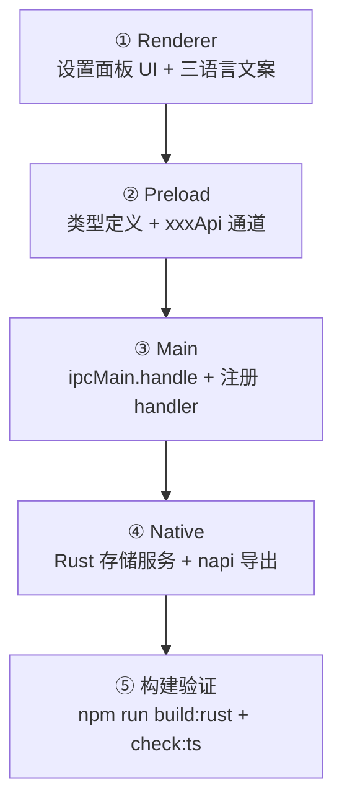

# 开发者指南

> 面向贡献者：环境搭建、常用命令、目录职责、新增功能的完整实现链路与代码规范。
> 配合阅读：[架构总览](1-架构总览.md)、[数据存储位置](../3-参考手册/4-数据存储位置.md)。

## 1. 环境要求

- **Node.js** >= 18（建议 20 LTS）
- **Rust** stable 工具链 + Cargo
- 平台要求：
  - Windows：Visual Studio Build Tools（C++ 工作负载）+ ConPTY（自动确保）
  - macOS：Xcode Command Line Tools
  - Linux：`build-essential`、`pkg-config`、系统 SQLite（或内置版本）

## 2. 常用命令

```bash
npm install                 # 安装依赖（postinstall 会 patch spectre / 确保 conpty.dll）

npm run dev                 # 开发模式（electron-vite dev，前端热重载）
npm run build:rust          # 编译 Rust native 模块 → snow_native.<platform>.node
npm run check:ts            # tsc --noEmit（提交前必须通过）
npm run build               # build:rust + tsc --noEmit + electron-vite build
npm run build:app           # 完整打包（electron-builder）
npm run build:win           # Windows 安装包（nsis + portable）
```

> ⚠️ 修改 `native/src/` 后必须重新执行 `npm run build:rust` 并**重启应用**
> （.node 模块不支持热替换）。修改 `src/` 走热重载即可。

## 3. 打包与安装

> 面向贡献者：把源码构建为可分发的安装包并安装到本机。安装版无法启动时的排查见
> [打包与安装故障排查](3-打包与安装故障排查.md)。

### 3.1 快速验证改动（无需打包）

- 仅改 `src/`（渲染 / 主进程 / 预加载）：`npm run dev` 开发模式热重载即可；
- 改了 `native/src/`（Rust）：先 `npm run build:rust` 再**重启应用**
  （`.node` 模块不支持热替换，见第 2 节注意事项）。

### 3.2 正式打包

```bash
npm run build:win      # Windows：NSIS 安装包 + portable 便携版（日常分发首选）
npm run build:app      # 当前平台完整打包（electron-builder 默认 target）
npm run build:mac      # macOS：dmg + zip
npm run build:linux    # Linux：AppImage + deb
```

产物输出到 `release/`：

| 产物 | 说明 |
| --- | --- |
| `Snow App Setup <version>.exe` | NSIS 安装包（推荐分发与安装） |
| `Snow App <version>.exe` | portable 便携版（免安装，双击即用） |
| `win-unpacked/` | 解包目录，`Snow App.exe` 可直接运行（调试用） |

耗时提示：native release 编译约 2-4 分钟，首次全量打包（含 electron-builder
下载 electron / nsis 依赖）通常 5-10 分钟；`.npmrc` 已配置 npmmirror 镜像加速下载。

### 3.3 安装 / 更新 / 卸载

- **安装**：运行 `Snow App Setup <version>.exe`，默认安装到
  `%LOCALAPPDATA%\Programs\snow-app`，自动创建开始菜单与桌面快捷方式；
- **portable**：直接双击 `Snow App <version>.exe` 运行，数据仍写入
  `~/.snow`（配置）与 `~/.snowapp`（数据库 / 图片）；
- **更新**：直接运行新版安装包覆盖安装，`~/.snow` 与 `~/.snowapp` 数据保留；
- **卸载**：系统设置 → 应用 → Snow App → 卸载（或运行安装目录下
  `Uninstall Snow App.exe`）。

### 3.4 验证安装版已包含最新改动

安装版使用的是**打包时刻**的代码与 native 产物，验证方式：

1. **版本**：`release\win-unpacked\Snow App.exe --version` 输出版本号；
2. **native 产物**：确认打包前执行过 `npm run build:rust`
   （`native/snow_native.win32-x64-msvc.node` 时间戳为打包时刻）；
3. **新 UI**：设置 → LSP 设置 → 项目页签出现「检测技术栈」按钮
   （`src/renderer/components/sidebar/LspSettingsPanel.tsx`）；
4. **新能力**：对 `.tsx` 文件执行 `lsp-diagnostics` 返回 typescript-language-server
   的真实诊断（Windows 上 npm 全局安装的 shim 服务器可正常启动，见
   [LSP 外部语言服务器接入设计](7-LSP外部语言服务器接入设计.md)）。

### 3.5 常见问题

| 问题 | 处理 |
| --- | --- |
| 安装版双击无反应（dev 正常） | 打包时 `out/` 被并发写入导致 asar 损坏：关闭所有 dev 进程 → 删除 `out/` → 重新打包（详见[故障排查](3-打包与安装故障排查.md)） |
| 改了 `native/src/` 但安装版行为无变化 | 确认执行过 `build:rust` 且 `out/` 无残留后重新打包 |
| electron-builder 下载依赖慢/失败 | 已配置 npmmirror registry；失败可重试或设置 `ELECTRON_MIRROR` 环境变量 |

## 4. 目录职责速查

```
snow-app/
├── src/
│   ├── main/               # Electron 主进程（编排层）
│   │   ├── app/            # 启动引导、窗口、会话代理、托盘、协议
│   │   ├── ipc/handlers/   # IPC 处理器（业务编排）
│   │   ├── native/         # Rust 桥（nativeBridge.ts 门控）
│   │   ├── pty/            # PTY 终端
│   │   ├── ssh/            # SSH / 远程工作区
│   │   ├── plugins/        # 插件运行时（worker 隔离）
│   │   ├── settings/       # 设置读写
│   │   ├── snowCli/        # ~/.snow CLI 兼容
│   │   ├── updater/        # 应用更新
│   │   ├── codex/          # Codex 兼容层
│   │   └── importConfig/   # 第三方配置导入
│   ├── preload/
│   │   ├── index.ts        # contextBridge.exposeInMainWorld("snow", api)
│   │   ├── modules/        # 每个领域一个 *Api.ts（ipcRenderer.invoke）
│   │   └── types/          # 跨层共享类型
│   └── renderer/
│       ├── components/     # 侧边栏 / 主内容 / 右侧面板
│       ├── hooks/          # 自定义 Hooks（useAgentLoop 等）
│       ├── i18n/lang/      # zh-CN.ts / en.ts / zh-TW.ts（必须同步）
│       └── utils/          # 前端工具
├── native/                 # Rust 原生层（能力层）
│   └── src/
│       ├── exports/        # napi 导出入口（*.rs 按领域）
│       ├── api/            # AI 供应商适配（anthropic/gemini/responses/chat）
│       ├── mcp/            # MCP 服务器（servers/）+ 外部客户端（external/）
│       ├── prompt/         # 系统提示词
│       └── storage/        # SQLite（database.rs / migrations.rs / services/）
├── scripts/                # 构建与工具脚本（build-native.cjs 等）
├── resources/              # 图标与静态资源
└── docs/                   # 文档（使用指南 + 参考手册 + 架构与开发）
```

## 5. 新增一个功能的完整链路

以「新增一个设置项」为例，展示跨层改动模式：

```
① Renderer（UI）
   src/renderer/components/sidebar/xxxSettingsPanel.tsx    # 表单 UI
   src/renderer/i18n/lang/{zh-CN,en,zh-TW}.ts               # 三语言文案

② Preload（类型 + 通道）
   src/preload/types/xxx.ts                                 # 类型定义
   src/preload/modules/xxxApi.ts                            # ipcRenderer.invoke("xxx:get")
   src/preload/index.ts                                     # 注册到 window.snow
   src/preload/types/index.ts                               # 导出类型

③ Main（IPC handler）
   src/main/ipc/handlers/xxxHandlers.ts                     # ipcMain.handle("xxx:get", ...)
   src/main/ipc/registerIpcHandlers.ts                      # 注册 handler

④ Native（Rust 能力）
   native/src/storage/services/xxx.rs                       # SQL 访问层
   native/src/exports/storage.rs                            # napi 导出
   （或 native/src/api/、native/src/mcp/servers/ 按领域）

⑤ 构建验证
   npm run build:rust   # Rust 变更后必须
   npm run check:ts     # 禁止 any、必须通过
```



**只读查询链路**：Renderer → `window.snow.xxxMethod` → `ipcRenderer.invoke` →
`ipcMain.handle` → `native.xxx`（storageReady 门控自动等待）→ rusqlite。
`src/preload/index.ts` 会展开各 `*Api` 对象，因此运行时 API 是扁平结构。

## 6. 代码规范

### 强制要求

- **禁止 `any` 类型**：`tsc --noEmit` 必须通过（项目 CI 红线）。
- **三语言同步**：修改任何 UI 文案，`zh-CN.ts` / `en.ts` / `zh-TW.ts` 必须同时更新。
- **Rust 代码**：保持 `cargo fmt` 风格；新增 SQL 走 `storage/services/` 现有模式。
- **数据库变更**：新增表 → 在 `database.rs::create_schema` 建表；新增列 →
  `migrations.rs` 的 post-schema 迁移（必须幂等），并提升 `user_version`。

### 设计约束

- 渲染进程**禁止**直接 require Node 模块（必须走 `window.snow.*`）。
- 主进程 native 调用**禁止**绕过 `nativeBridge`（除非初始化阶段，见
  `bootstrap.ts` 注释：初始化用 raw binding 避免 storageReady 死锁）。
- **主进程为 ESM**：主进程代码以 ESM 运行，禁止使用 `__dirname` /
  `__filename`，一律使用 `import.meta.dirname` / `import.meta.filename`
  （`src/main/app/`、`nativeBridge.ts` 等已完成迁移）。
- 新增 MCP 工具时参考 `native/src/mcp/servers/` 现有工具的参数描述风格
  （schema 描述会直接暴露给 AI 模型，务必写清楚约束与默认值）。
- 文件修改遵循工作区约定：优先 `apply_patch`/filesystem 工具，命令一律
  使用 PowerShell 语法（Windows 默认环境）。
- **前端设置页样式复用**：侧边栏设置面板一律复用 `api-settings-*` 共享类
  （`api-settings-page` → `page-header` → `summary-grid` → 操作区 →
  `table-panel`），禁止自建平行布局；列比例用页面级类只覆写
  `grid-template-columns`。样式统一写在 `src/renderer/styles.css`，
  新增/删除类前先 `grep -n "<类名>"` 全表搜索（历史布局遗留类仍被新面板
  复用，重复定义会导致改了一处另一处不生效）。详细约定与 CSS 特异性陷阱
  见 `.trellis/spec/frontend/component-guidelines.md`。

## 7. 常见坑

| 问题                                                                | 说明                                                                                                                                                                                                                                       |
| ------------------------------------------------------------------- | ------------------------------------------------------------------------------------------------------------------------------------------------------------------------------------------------------------------------------------------ |
| native 改动不生效                                                   | 忘了 `npm run build:rust` 或未重启应用（.node 不支持热替换）                                                                                                                                                                               |
| storageReady 死锁                                                   | 在初始化完成前调用 native 且未经 Proxy——只有 bootstrap 可用 raw binding                                                                                                                                                                    |
| tsc 报错找不到模块                                                  | 新增依赖后 `npm install`；lockfile 变更随 PR 一起提交                                                                                                                                                                                      |
| 文案漏翻译                                                          | 三语言文件结构必须一致，缺 key 会在运行时报 undefined                                                                                                                                                                                      |
| CRLF 警告                                                           | Windows 下 Git 提示 CRLF→LF 是正常现象（仓库统一 LF）                                                                                                                                                                                      |
| 数据库迁移失败                                                      | 迁移必须幂等；先在备份库上验证再提交                                                                                                                                                                                                       |
| 独立脚本调 `callMcpTool` 报 `Create threadsafe function ... failed` | `callMcpTool` 第 7~12 位（onChunk、onBrowserCommand、onUserQuestion、onAppControl、onRemoteWorkspaceCommand、onTerminalCommand）全部是**必需的** `ThreadsafeFunction`，传 `undefined` 会以 `InvalidArg` 失败；见下方详细介绍               |
| CSS 样式不生效                                                      | 共享容器内自定义类被覆盖：`.api-settings-summary-card span/small`（特异性 0,1,1）会静默覆盖裸类选择器（0,1,0）——子类选择器必须带容器类前缀（如 `.imagegen-concurrency-card .imagegen-concurrency-head`）                                   |
| 同一类在 styles.css 有两份定义                                      | 历史布局遗留类（如 ~12180 行的 `imagegen-*`）仍被新面板复用；写新规则前先 `grep -n` 全表搜索，只加 delta 规则、勿重复定义                                                                                                                  |
| 大块 search-replace 后文件损坏                                      | 替换超长 JSX/CSS 块可能残留旧尾部（`})}`、多余 `}`）；替换后立即读回验证配对，最后跑 `tsc --noEmit` + `electron-vite build`                                                                                                                |
| imagegen 参考图只显示占位框                                         | `images:resolve-upload-image` 曾用 `join(uploadRoot, normalized)` 拼接，而 `normalized` 已带 `upload/` 前缀 → `uploadRoot\\upload\\...` 双重前缀导致读文件永远失败；必须基于 `dirname(databasePath)` 拼接（`imageHandlers.ts` 已有修复注释） |
| Markdown 里 `image/`/`upload/` 图片破图                            | markdown worker 的 image 规则原本只代理 http(s) 外部图，本地相对路径会以相对 URL 加载失败 → 破损图标；现在本地路径（`image/`、`upload/`，先 decode 再统一分隔符，拒绝 `..` 与绝对路径，见 `markdownWorker.ts` 的 `normalizeLocalImagePath`）与外部图统一改写为 `img-proxy://` 协议 URL（`localImageProxyUrl`），主进程协议处理器（`imageProxyProtocol.ts` 的 `serveLocalImage`）定位图库/upload 根目录后直接读盘返回，渲染进程无需 IPC/data URL 中转 |
| 排查渲染端图片/文件链路                                             | 用 `node` 直接 `require("../native/index.cjs")` 调 `initializeAppStorage()` 拿 `databasePath`，复刻主进程路径逻辑 + `readFile` 验证，不依赖 Electron 即可定位                                                                              |

### callMcpTool 回调参数（独立脚本 / e2e 验证）

`native.callMcpTool(toolFullName, argsJson, ...)` 是 native 暴露的 MCP 工具调用入口，
签名共 15 个参数。其中 **6 个回调参数全部是必需的** `ThreadsafeFunction`
（Rust 侧类型非 `Option`），JS 侧**必须逐一传函数**，传 `undefined`/`null`
会在参数转换阶段同步抛出：

```
Error: Create threadsafe function in ThreadsafeFunction::create failed
code: 'InvalidArg'
```

| 参数位置 | 参数名                                                                      | 类型     | 说明                                      |
| -------- | --------------------------------------------------------------------------- | -------- | ----------------------------------------- |
| 1        | `toolFullName`                                                              | string   | 工具全名，如 `config-list`                |
| 2        | `argsJson`                                                                  | string   | 参数的 JSON 字符串                        |
| 3~6      | projectId / checkpointIds / checkpointWorkDir / sensitiveAuthorizationToken | optional | 可传 `undefined`                          |
| 7        | `onChunk`                                                                   | 函数     | 流式 chunk 回调（`BashStreamChunk`）      |
| 8        | `onBrowserCommand`                                                          | 异步函数 | 浏览器命令转发                            |
| 9        | `onUserQuestion`                                                            | 异步函数 | 用户提问交互                              |
| 10       | `onAppControl`                                                              | 异步函数 | 应用控制命令                              |
| 11       | `onRemoteWorkspaceCommand`                                                  | 异步函数 | 远程（SSH）命令转发                       |
| 12       | `onTerminalCommand`                                                         | 异步函数 | **终端 PTY 命令转发（新增回调，最易漏）** |
| 13~15    | subAgentAllowedTools / planMode / planApproved                              | optional | 可传 `undefined`                          |

独立 Node 脚本中的占位写法（参考 `scripts/e2e-verify-config.cjs`）：

```js
const noop = () => undefined;
const asyncNoop = async () => "";
const result = await native.callMcpTool(
  "config-list",
  JSON.stringify({ scope: "imagegen" }),
  undefined,
  undefined,
  undefined,
  undefined, // projectId / checkpointIds / checkpointWorkDir / sensitiveAuthorizationToken
  noop, // onChunk
  asyncNoop, // onBrowserCommand
  asyncNoop, // onUserQuestion
  asyncNoop, // onAppControl
  asyncNoop, // onRemoteWorkspaceCommand
  asyncNoop, // onTerminalCommand ← 必须提供，共 6 个回调
  undefined,
  undefined,
  undefined // subAgentAllowedTools / planMode / planApproved
);
// 返回 Promise<string>，为工具结果的 JSON 字符串
```

> 若某个回调传 `undefined`，napi-rs 会尝试用 `undefined` 创建
> `ThreadsafeFunction` 并返回 `InvalidArg`——这是参数校验报错，不是工具逻辑错误。
> App 渲染端（`nativeBridge`）始终传满 6 个真实回调，因此不受影响；
> 只有手写的独立脚本需要留意。

## 8. 提交约定

提交信息遵循 [Conventional Commits](https://www.conventionalcommits.org/zh-hans/) 规范，
并保持与仓库历史一致的风格：`type(scope): 中文摘要 - 补充说明`。

### 8.1 提交信息格式

一条提交信息由**标题（header）**与可选的**正文（body）**组成：

```text
<type>(<scope>): <summary>

<body>
```

- **标题**：一行，不超过 72 字符；`type` 与 `scope` 小写，`summary` 使用中文，
  与技术术语混排时保留英文术语原样（如 `N+1`、`IPC`、`localStorage`）。
- **正文**：可多行，解释"为什么这样改"以及影响范围；需要时用 `-` 列出要点。
  只在改动复杂或行为有破坏性变更时写正文，简单改动只写标题即可。

### 8.2 type 类型

| type | 用途 | 示例 |
| --- | --- | --- |
| `feat` | 新功能 | `feat(chat): 输入草稿按会话持久化 - 切换会话不丢失输入` |
| `fix` | Bug 修复 | `fix(imagegen): 模型能力校验 - 不支持多图的模型禁用参考图` |
| `refactor` | 重构，行为不变 | `refactor(sidebar): 批量删除改用批量 API - 消除 N+1` |
| `docs` | 文档变更 | `docs: 补充 Git 提交信息规范说明` |
| `chore` | 构建/依赖/杂项 | `chore: 排除 e2e-verify-config.cjs 出版本控制` |
| `perf` | 性能优化 | `perf(chat): 子代理查询合并为单条 SQL - 避免 N+1` |
| `test` | 测试 | `test(storage): 批量删除级联删除用例` |
| `style` | 样式/格式（不影响逻辑） | `style: 统一导入排序` |

### 8.3 scope（可选）

`scope` 表示改动所属模块，取小写短词，例如：`chat`、`sidebar`、`imagegen`、
`storage`、`ipc`、`native`、`docs`。不涉及具体模块时省略 scope。

### 8.4 摘要写法

- 以动词开头，描述"做了什么"，而非"是什么"；
- 一条提交只做一件事，摘要与改动一一对应，不要混入无关改动；
- 需要补充背景或动机时用 ` - ` 追加说明，例如：
  `feat(chat): 输入草稿按会话持久化 - 切换会话不丢失输入`。

### 8.5 正文示例

```text
fix(sidebar): 修复右键会话菜单不显示

根因：关闭菜单的 document 级 contextmenu 监听用三点按钮容器判断
目标是否在组件内，右键发生在会话行其他区域时被误判为外部点击，
同一事件循环内菜单刚打开就被关闭（React 批处理后锚点被清空）。

修复：改用 closest('.chat-item') 比较所在会话行，同一行内右键
不关闭菜单，其它区域右键正常切换。
```

### 8.6 提交前检查

- `npm run check:ts`（`tsc --noEmit`）必须通过；
- 不提交：`out/`、`release/`、`node_modules/`、`.tmp-*.cjs`、用户数据目录；
- 合并上游：`git fetch upstream && git merge upstream/main`，冲突在本地解决；
- 一次提交只包含逻辑相关的改动，未完成的 feature 文件不要混入同一提交。

## 附录：视觉文本化与图生图参考图机制

主模型不支持视觉（关闭 **Supports vision** 且配置了独立的视觉模型）时，
`native/src/api/vision.rs` 的 `textify_images_in_messages` 会把消息中的
`@@image:...@@` 标签替换为视觉模型的文字描述（进程内按图片哈希缓存，避免
多轮重复调用视觉 API）。**用户消息**在文本化时会额外注入图生图引导：

```text
[The user attached N reference image(s). When the user asks to generate or edit
an image based on them, call the imagegen-generate tool and pass the
corresponding JSON object(s) below in its "images" parameter (image-to-image)
— do NOT generate from the text description alone.]
[Image #1]
[Image description: <视觉模型生成的文字描述>]
[Reference image #1 for imagegen-generate: {"path":"upload/2026-08-05/a1b2c3.png","mimeType":"image/png"}]
```

设计要点与约定：

- **为什么用 `path` 而不是 base64**：纯文本模型的上下文是稀缺资源，一张
  约 1MB 的图片 base64 展开约 34 万 token。引用块只携带相对路径（几十
  字节），由 `imagegen-generate` 执行时（`mcp/servers/imagegen.rs` 的
  `load_reference_image_from_path`）自行读文件转 base64。
- **路径边界分两层**：视觉文本化自动生成的引用块始终只写 `upload/` 前缀的
  安全相对路径，并拒绝 `..` 穿越，避免把机器绝对路径带入模型上下文；
  `imagegen-generate` 的 `images[].path` 运行时接口还支持可信的绝对磁盘路径。
  渲染端缩略图经主进程 `images:resolve-upload-image` IPC
  （`src/main/ipc/handlers/imageHandlers.ts`）读取自动引用块时继续执行双重校验
  （前缀检查 + normalize 后前缀复核）。
- **只附加到用户消息**：工具结果（如浏览器截图）只文本化、不附加引用块，
  避免无关图片膨胀上下文；`ChatImage.source`（`api/conversation/images.rs`）
  记录磁盘相对路径，data URL 形式的未持久化图片回退为内联
  `{"data":"<base64>","mimeType":"..."}`。
- **编号对应**：引用块编号与 `[Image #N]` 占位符一一对应；多图时引导句
  只注入一次。
- **历史消息保留**：引用块随上下文重放，后续轮次可继续引用之前上传的图。
- **上限**：服务端 `MAX_IMAGES = 14`（Gemini 3 Pro Image 官方上限）、单张
  ≤20MB；工具描述引导模型单次 ≤5 张，兼容 OpenAI edits 更严格的限制。
- **改动涉及**：`api/conversation/images.rs`（`source` 字段）、
  `api/vision.rs`（引用块注入）、`mcp/servers/imagegen.rs`（path 解析）、
  `src/main/ipc/handlers/imageHandlers.ts`（缩略图 IPC）、
  `ImageGenToolCall.tsx`（缩略图展示 + 进程内缓存）。
