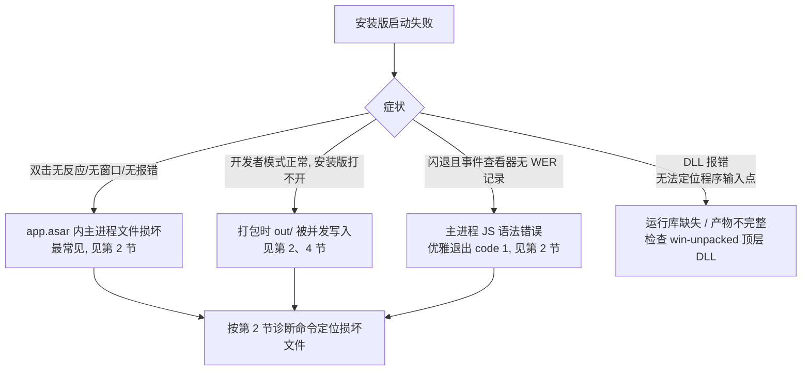

# 打包与安装故障排查

> 面向贡献者：安装版（NSIS / portable / win-unpacked）无法启动时的排查方法与经验。
> 配合阅读：[开发者指南](2-开发者指南.md)、[架构总览](1-架构总览.md)。

## 1. 症状速查

| 症状 | 可能原因 | 排查方向 |
| --- | --- | --- |
| 安装版双击无反应、无窗口、无报错弹窗 | `app.asar` 内主进程文件损坏（最常见） | 见本文第 2 节 |
| 开发者模式（`npm run dev`）正常，安装版打不开 | 打包时 `out/` 被并发写入 | 见第 2、4 节 |
| 安装版闪退，事件查看器无 WER 崩溃记录 | 主进程 JS 语法错误（优雅退出 code 1） | 见第 2 节诊断命令 |
| 双击后出现"无法定位程序输入点"等 DLL 报错 | 运行库缺失 / 产物不完整 | 检查 `win-unpacked` 顶层 DLL 是否齐全 |

> 安装版启动失败时**通常没有任何日志**：`snowLog` 走 Rust `writeAppLog` 写入 SQLite，
> 主进程在日志初始化之前就已崩溃，因此 `~/.snow/log` 与应用日志都不会有记录。
> 判断依据：进程启动后数秒内退出，退出码为 `1`（Node/Electron 未捕获异常默认退出码）。



## 2. 案例：v0.1.16 安装版打不开（2026-08-05）

### 2.1 现象

- `npm run build:win` 打包成功（NSIS + portable 均生成）；
- 安装后双击 `Snow App.exe`：无窗口、无报错、进程数秒后消失（退出码 1）；
- `npm run dev` 完全正常。

### 2.2 根因

`release/win-unpacked/resources/app.asar` 内的 **`out/main/index.js` 内容损坏**（尾部截断，
`SyntaxError: Unexpected token '}'`）。Electron 启动时加载主进程即解析失败 → 进程退出 code 1。

损坏原因：**打包时 `out/` 目录正被并发写入**（dev 模式与打包构建同时操作 `out/main/index.js`），
electron-builder 将写了一半的文件打进了 `app.asar`。

关键证据链：

- 用 `ELECTRON_RUN_AS_NODE=1` 读 asar 内真实字节，与本地 `out/main/index.js` 比对 hash 不一致；
- `import()` 加载 asar 内主进程文件报 `SyntaxError: Unexpected token '}'`（本地文件解析正常）；
- 将 0.1.15 的 `app.asar` 替换进 0.1.16 的 `win-unpacked`，应用即可正常启动 → 问题锁定在 asar 内容。

### 2.3 修复

1. 关闭所有 dev 进程（`Get-Process electron | Stop-Process -Force`，注意勿杀 CLI 自身进程）；
2. 删除 `out/` 目录（`Remove-Item out -Recurse -Force`）；
3. 重新执行 `npm run build:win`；
4. 验证新产物可启动（见第 3 节）。

## 3. 验证打包产物是否可启动

### 3.1 进程存活测试（最直接）

```powershell
$p = Start-Process -FilePath "release\win-unpacked\Snow App.exe" -PassThru
Start-Sleep -Seconds 15
if (Get-Process -Id $p.Id -ErrorAction SilentlyContinue) { "ALIVE" } else { "DEAD" }
Stop-Process -Id $p.Id -Force -ErrorAction SilentlyContinue
```

正常应用启动后会有 4 个左右 `Snow App` 进程（主进程 + 渲染 + GPU + 工具进程），
且 `%APPDATA%\snow-app` 下 `Local Storage` / `Preferences` 等文件会更新。

### 3.2 主进程代码完整性（定位损坏文件）

```powershell
# 读 asar 内真实内容（Electron 自带 asar 支持，不要用 @electron/asar 的 extractAll）
$env:ELECTRON_RUN_AS_NODE = "1"
& "node_modules\electron\dist\electron.exe" -e "const fs=require('fs'),c=require('crypto');
  const a='release/win-unpacked/resources/app.asar';
  const b=fs.readFileSync(a+'/out/main/index.js');
  const l=fs.readFileSync('out/main/index.js');
  console.log('asar:', c.createHash('md5').update(b).digest('hex'), b.length);
  console.log('local:', c.createHash('md5').update(l).digest('hex'), l.length);
  console.log('identical:', b.equals(l));"
```

- `identical: false` 且大小相同 → asar 内文件被损坏或打包时读到了写入中的文件；
- 进一步用 `import()` 加载 asar 内文件验证语法（放至带 `{"type":"module"}` 的临时目录）。

### 3.3 退出码

```powershell
node -e "const {spawn}=require('child_process');
  const p=spawn('release/win-unpacked/Snow App.exe',['--version'],{stdio:['ignore','pipe','pipe']});
  p.on('exit',c=>console.log('exit',c))"
```

`--version` 正常应输出 `v37.x.x` 并退出 0；退出 1 且无输出说明主进程加载阶段即失败。

## 4. 预防措施

1. **打包前务必关闭 dev 模式**：`npm run dev` 与 `npm run build:win` 不能同时运行，
   二者都会写 `out/`，并发写入会产出损坏的主进程文件；
2. 打包前清空 `out/`（`Remove-Item out -Recurse -Force`）确保产物来自本次构建；
3. 打包含 Git 未提交改动时注意：`git log -1 --format="%ci"` 可确认打包时代码版本；
4. 发布前按第 3 节跑一遍启动验证。

## 5. 诊断工具注意事项

- **不要用 `@electron/asar` 的 `extractAll` / `extractFile` 判断内容完整性**：
  对部分文件（尤其顶层文件与 unpacked 条目）会读错位/读成 stub，产生误导；
- `getRawHeader` 返回的 `offset` 是**相对值**（相对数据区起点），直接按偏移读文件也会得到错误内容；
- 可靠方式：`ELECTRON_RUN_AS_NODE=1 electron.exe -e "require('fs').readFileSync('app.asar/<路径>')"`
  （Electron 的 fs 对 asar 路径有原生支持，读到的是应用实际加载的字节）。
