# Agent 运行时与工具编排

> 本文描述 Snow App 从模型请求到工具结果回灌的实际运行时边界。核心结论：**主 Agent loop 在 Renderer；provider 流、MCP 执行和持久化在 Rust。**

## 1. 组件视图

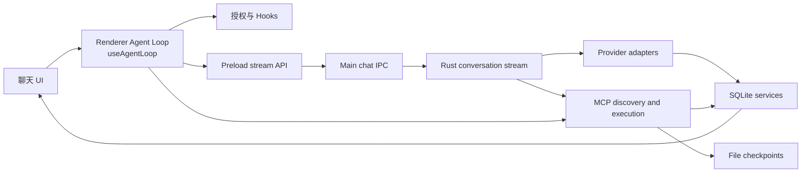

职责边界：

- `useAgentLoop.ts` 维护会话级循环、流状态、工具轮次、暂停/终止及排队消息。
- preload 与 `chatHandlers.ts` 只提供按 `streamId` 隔离的流传输。
- Rust provider 适配器负责请求格式、流解析和每轮模型交换落库。
- `mcp/tools.rs` 负责工具发现、强制策略、路由、隐私掩码和 checkpoint 衔接。

## 2. 模型适配层

统一入口 `native/src/api/conversation/stream.rs::create_response_stream` 根据 `request_method` 分派：

| request_method | 适配目录 | 协议 |
|---|---|---|
| `chat` | `native/src/api/chat/` | OpenAI Chat Completions |
| `responses` | `native/src/api/responses/` | OpenAI Responses |
| `anthropic` | `native/src/api/anthropic/` | Anthropic Messages |
| `gemini` | `native/src/api/gemini/` | Google Gemini |

适配器共同负责 provider payload、规范化消息转换、SSE 或等价流解析、文本/thinking/tool calls/usage 累积及 `store_chat_exchange`。工具定义分别由 `tools_as_openai_chat_json`、`tools_as_openai_responses_json`、`tools_as_anthropic_json`、`tools_as_gemini_json` 生成；工具历史跨协议转换集中在 `api/conversation/tool_messages.rs`。

API profile 解析优先考虑请求显式 profile、会话绑定 profile，再回退全局 active profile。子代理始终使用其配置 profile，并强制关闭主会话专属的 Plan/Goal Mode。

## 3. 流式事件协议

1. Renderer 调用 `window.snow.createResponseStream(request, onChunk, onStreamId)`。
2. `apiConfigApi.ts` 同步生成 `streamId`、注册 `chat:create-response:chunk` 监听，再 invoke 主进程。
3. `chatHandlers.ts` 校验参数并调用 `native.createResponseStream`。
4. Rust callback 到达后，Main 通过 `safeSend` 发送 `{ streamId, chunk }`。
5. preload 只把匹配 `streamId` 的 chunk 交给当前回调。
6. `createStreamChunkHandler` 更新文本、thinking、工具执行 ID和流指标；invoke Promise 返回最终 `ResponsesApiResult`。

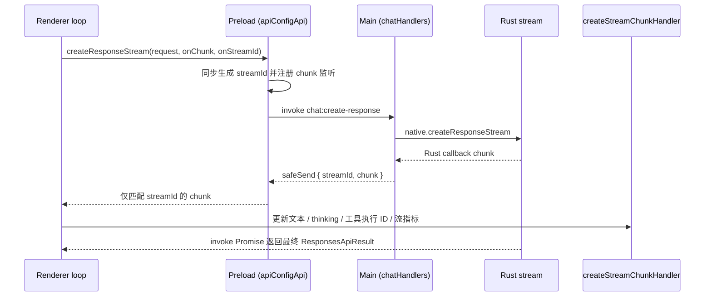

这条链与 `src/main/app/sessionProxy.ts` 无关；后者是 Electron 网络代理配置。

## 4. Renderer 主循环

每个会话具有独立 session state、`runId`、`streamId`、AbortController、暂停状态和排队输入，因此切换会话不会终止后台运行。

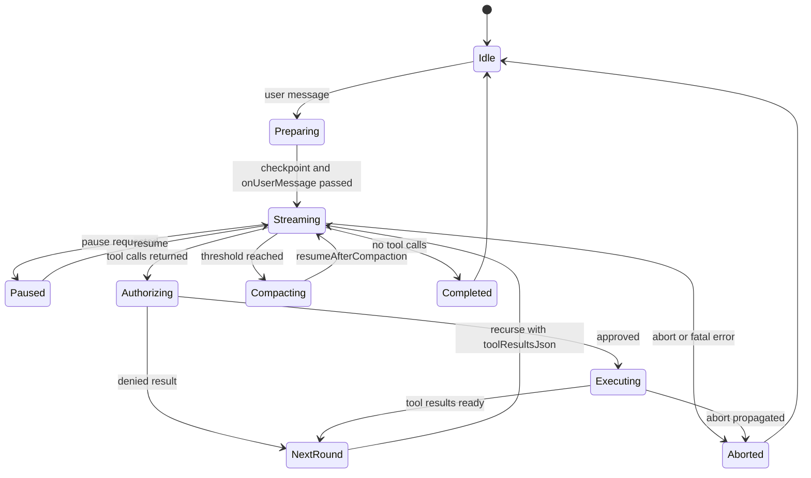

一轮的核心步骤是：调用模型流、解析 `toolCallsJson`、按授权结果构造 executor、执行工具、生成结构化 `toolResultsJson`，再递归进入下一轮。没有工具调用时结束，或先消费已排队的用户消息。循环开始前创建本地文件 checkpoint；`onUserMessage` 在首轮前执行，`onStop` 在最终清理时执行。

## 5. 工具发现

`collect_all_mcp_tools` 的过滤与合并顺序：

1. 解析全局 scope 与项目 scope。
2. 仅当项目存在、启用 codebase 且已有向量 chunk 时暴露 codebase 工具。
3. 仅当至少一个 imagegen channel 启用时暴露 imagegen。
4. 按固定顺序读取 14 个内置服务；Plan approval 只在 Plan Mode 请求中出现。
5. 应用全局与项目级 server/tool enable 状态（全局禁用优先）；terminal 默认禁用，须项目显式开启。
6. 动态加入 Skills 工具。
7. 并行发现外部 MCP 的 stdio/HTTP 工具；单个服务失败只记录错误，不使全部发现失败。

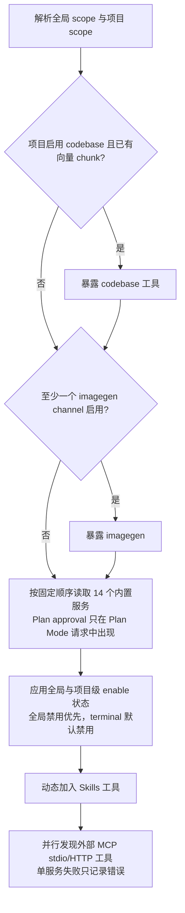

子代理使用 `collect_allowed_mcp_tools`。其 `tools_json` 必须是字符串数组；仅内置子代理可使用 `*`。全局或项目禁用的工具会被拒绝，而不是静默扩大权限。外部 MCP 支持 `server/discover`，并保留 legacy initialize fallback。

**工具域系统提示词注入**：工具可见性之外，系统提示词构建（`native/src/api/conversation/context.rs`）还会按工具域动态追加指引章节，且**注入条件与工具可见性保持一致**——用户禁用的工具域绝不注入，避免诱导调用不可见工具：

- **`## Language Servers`**（LSP 域，`native/src/mcp/servers/lsp/mod.rs` 的 `build_system_prompt_section`）：项目启用了可用外部语言服务器（配置 enabled + 命令已安装 + 语言匹配）且域 scope 允许时注入。列出服务器及运行状态（running / crashed / 未启动），按能力分组列出应优先使用的 `lsp-*` 工具，并强制语义查询 MUST 走 `lsp-*`（grep 仅限纯文本定位）；同时对未运行服务器后台预热，消除模型首次调用的冷启动延迟。
- **`## Image Generation`**（imagegen 域，`native/src/mcp/servers/imagegen/mod.rs` 的 `build_system_prompt_section`）：配置了至少一个可用生图渠道且域 scope 允许时注入。列出可用渠道（id / 名称 / 协议，非敏感摘要），并强制多图 MUST 并行多次调用 `imagegen-generate`（一次一图，legacy 的 `prompts` / `n>1` 不是多图路径）；连续 ≥2 个并行调用由 UI 自动合并为 `ImageGenGallery` 统一网格。
- 两个章节都追加在提示词**末尾**（状态变化只影响尾部，最小化 prompt cache 前缀失效），任何查询失败静默降级为空字符串（不打断请求）；普通 / Plan / Goal 三种模式统一注入，子代理系统提示词同样携带。

## 6. 工具调用与 checkpoint

`call_mcp_tool` 依次执行：清洗污染工具名、校验 Plan 特殊工具、阻止未批准 Plan 的写入、校验全局与项目 enable 状态、校验子代理白名单、解析本地/SSH workspace、把本地相对路径落到项目根、补充工具前 checkpoint、按工具类型路由、隐私掩码输出、更新工具后 checkpoint。

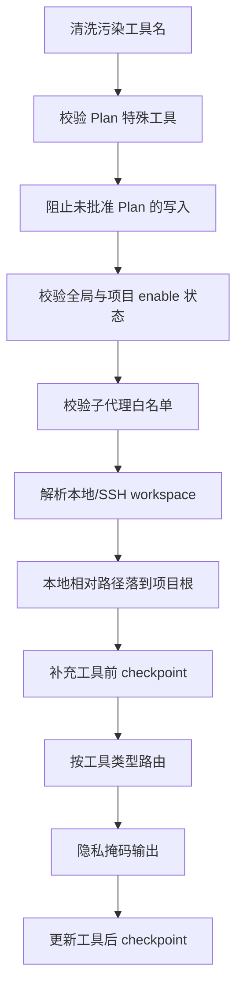

路由包含 bash、grep、remote filesystem、browser、user interaction、app control、terminal、imagegen、external MCP 和普通 builtin。可取消的远程执行通过 `tool_execution` chunk 返回 execution ID。checkpoint capture 使主代理与子代理的文件修改可被统一预览和恢复。

## 7. 授权与强制策略

Renderer `useToolAuthorization.ts` 组合以下策略：

- YOLO Mode 可自动放行普通工具。
- 全局 `permissions.alwaysApprovedTools`（`~/.snow/permissions.json`）与项目级授权合并为免审批列表；用户选择“始终允许”时持久化到项目授权设置，「项目工具授权」面板可添加/删除项目级授权，并只读展示全局列表。
- bash 先匹配敏感命令；敏感命令不能被“全部批准”绕过。
- interactive bash 由交互终端 UI 承担确认，不重复弹单独敏感命令框。
- `toolConfirmation` Hook 可在普通用户确认之前放行或拒绝。
- 待确认请求使用 Promise 挂起，直到用户选择。

Rust 侧是第二道边界：`bash.rs` 对敏感命令验证短期单次 authorization token，`call_mcp_tool` 强制 Plan Mode 和子代理 allowed-tools。前端便捷策略不能替代后端强制检查。

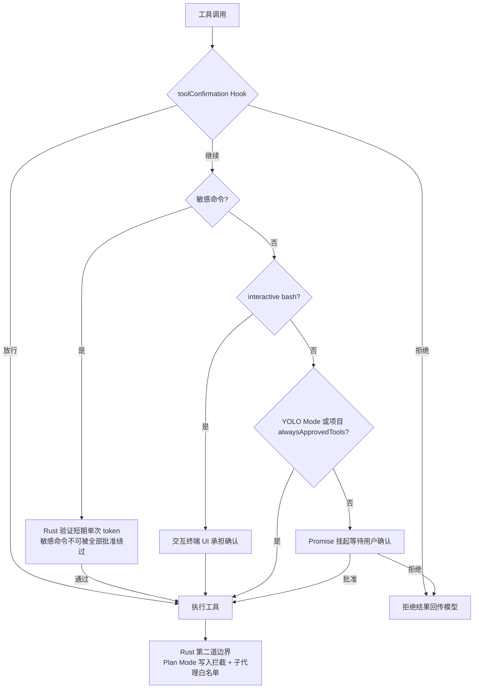

## 8. Hooks

支持的 Hook 类型为：`onUserMessage`、`beforeToolCall`、`toolConfirmation`、`afterToolCall`、`onSubAgentComplete`、`beforeSubAgentStart`、`beforeCompress`、`onSessionStart`、`onStop`。

命令 Hook 退出码：0 表示通过，stdout 可作为 Hook Context；1 表示软警告，特定 decision JSON 可触发用户决策；2 及以上表示中止。阻塞型 Hook 的结果通过 `hookOutcome.ts` 统一解释；`onStop` 等 fire-and-forget Hook 不阻塞主清理。

工具链顺序为：

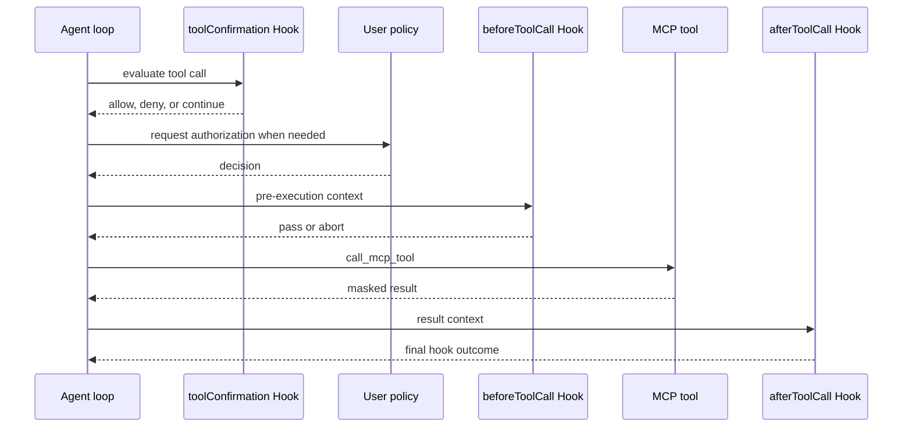

并行 imagegen 和并行子代理有批次专用逻辑，Hook 生命周期保持，但不能假设所有调用严格串行。

## 9. 子代理

模型调用 `sub-agents-activate` 后，Renderer 先运行 `beforeSubAgentStart`，再创建独立 conversation/session 并持久化 `running`。子代理读取自身系统提示词、`tools_json` 和 API profile，在独立 Renderer loop 中流式运行。

主会话构建系统提示词时，会从 `sub_agent_configs` 查询并**动态注入可用子代理清单**（`agentId`、名称、用途描述）与选择规则——主 Agent 据此挑选最匹配的 `agentId`，而不是默认使用内置 `agent_general`。清单解析与激活一致：**当前项目（`directory_id`）的项目级子代理优先**，同 `agentId` 覆盖全局；其他项目的子代理不注入。

子代理继承父会话 checkpoint IDs，使文件改动纳入父会话回滚范围；Rust 同时限制 allowed-tools，并在父 Plan 尚未批准时阻止写入。子代理不能调用或授予 Plan approval。完成后会话标记 `completed` 或 `failed`，执行 `onSubAgentComplete`，随后变为只读；其后续排队输入转发父会话。父 abort 会传播到活动子代理，应用启动会把遗留 `running` 状态取消。

激活与主代理并行执行（渲染进程预启动），结束时以结构化 JSON 作为工具结果回传主代理，主代理不做自动重试，由模型根据结果决定下一步：正常完成返回 `{success: true, conversationId, agentName, summary}`（`onSubAgentComplete` 可 pass 追加上下文、warn 追加警告或 abort 替换 summary）；API 流失败时把失败内容作为最终输出并标记消息为 error；异常时返回 `{success: false, error}`，会话持久化 `failed` 并广播失败事件，子会话中用户排队插入的消息转发父会话；用户中断返回 "Sub-agent interrupted by user"；父会话 Plan 未批准时立即停止并把控制权交还主循环。子代理没有独立的全局超时（只有单工具层超时）；停止主代理会通过 `childSubAgentIds` 递归级联取消全部后代子代理（中止流、拒绝挂起授权、杀掉 bash 子进程），应用启动时清理遗留 `running` 会话。

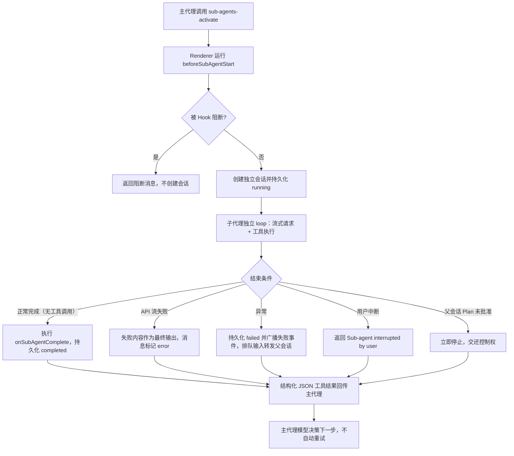

## 10. 上下文压缩

压缩可由用户手动触发，或在 token 总量达到 `autoCompressThreshold` 时自动触发：

1. 本地 workspace 尝试创建临时 checkpoint；SSH 跳过本地文件 checkpoint。
2. 执行 `beforeCompress`。
3. 发送 `contextCompaction: true` 和 `checkpointId` 的模型流；压缩请求不暴露工具。
4. Rust 使用完整有效上下文生成 handoff，并以 `status = 'context_compaction'`、真实 usage 和 checkpoint ID 持久化边界。
5. Renderer 重载数据库消息；自动压缩以 `resumeAfterCompaction` 恢复原循环。
6. 失败时删除本次临时 checkpoint。

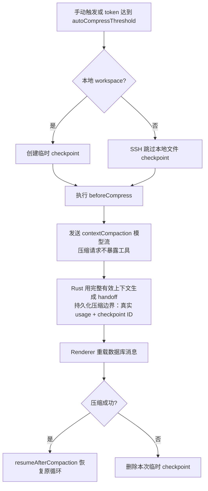

## 11. 回滚

`useRollback.ts` 先 abort 当前流并取消 summary generation，计算 checkpoint diff 和将删除的 TODO，展示预览。确认后等待流与 summary Promise 完全结束，避免和 SQLite 写事务竞态。用户可选择只截断对话，或同时调用 `restoreCheckpoint` 恢复文件。

首条消息回滚可删除整个 conversation；其余情况调用 `truncateConversation` 并清理废弃 checkpoint。回滚 `context_compaction` 边界时必须使用边界自身 `responseId` 截断，不能把整段会话误判为首条消息。

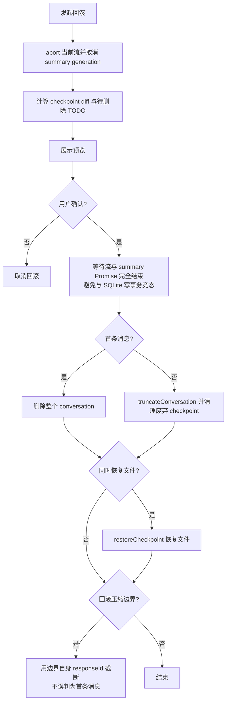

## 12. 数据落库

每个 provider 适配器在模型流结束后调用 `store_chat_exchange`，保存用户消息、assistant 内容、thinking、`tool_calls_json`、response/checkpoint ID、token usage 和 compaction 状态。Renderer 随后执行工具；下一轮的 tool-role 消息携带 `toolResultsJson`，并在下一次模型交换中持久化。`usage_records` 对成功、失败和压缩调用分别记账。

## 13. 端到端时序

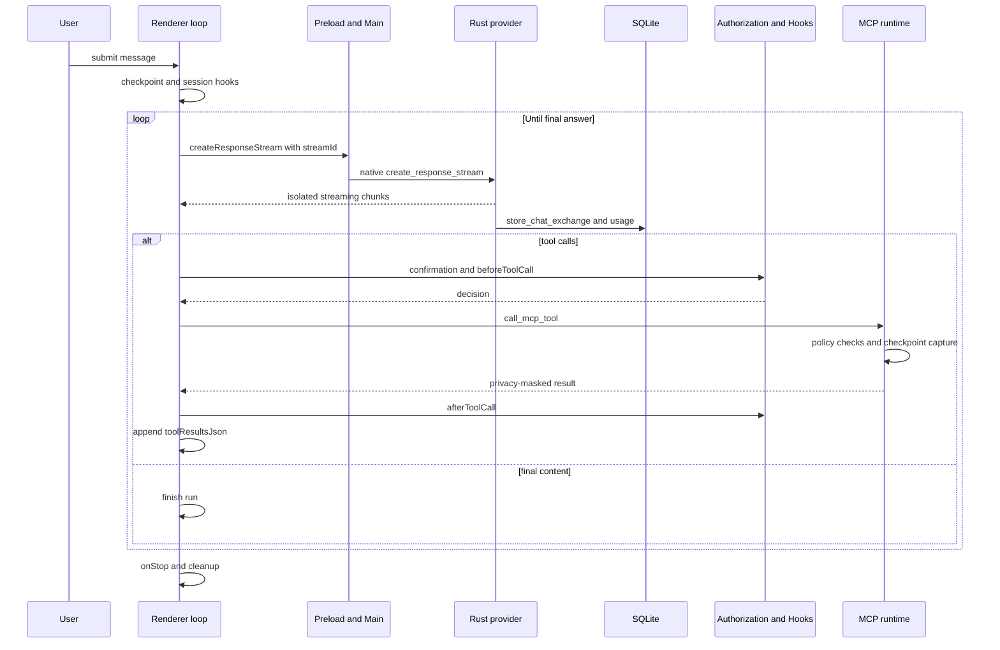

## 14. 状态不变量

- chunk 必须按 `streamId` 过滤；完成或 abort 后移除监听。
- 同一会话只接受当前 `runId` 的更新，旧 Promise 不得覆盖新运行。
- 子代理权限不得超过显式 allowed-tools 和项目启用范围。
- Plan 未批准时，Renderer UX 与 Rust 写入拦截必须同时成立。
- 模型交换先落库，工具结果在下一轮作为结构化 tool-role 历史进入。
- 回滚前必须等待仍可能写库的异步任务收敛。

## 15. 源码锚点

| 主题 | 文件 |
|---|---|
| 主循环与流状态 | `src/renderer/components/mainContent/chatMessages/hooks/useAgentLoop.ts`、`agentLoopHelpers.ts` |
| 工具执行与授权 | `toolExecution.ts`、`useToolAuthorization.ts` |
| Hooks | `hooks/hookOutcome.ts`、`useToolAuthorization.ts`、`native/src/hooks/` |
| 子代理 | `hooks/subAgentActivation.ts`、`native/src/api/conversation/sub_agent.rs`、`native/src/mcp/servers/sub_agents.rs` |
| 压缩与回滚 | `hooks/useCompaction.ts`、`hooks/useRollback.ts`、`native/src/exports/checkpoint.rs` |
| 流 IPC | `src/preload/modules/apiConfigApi.ts`、`src/main/ipc/handlers/chatHandlers.ts`、`src/main/utils/safeSend.ts` |
| Provider 分派 | `native/src/api/conversation/stream.rs`、`tool_messages.rs` |
| MCP 发现与调用 | `native/src/mcp/builtin.rs`、`native/src/mcp/tools.rs`、`native/src/mcp/external/` |
| 会话与 usage 存储 | `native/src/storage/services/chat_conversations.rs`、`usage_records.rs` |
