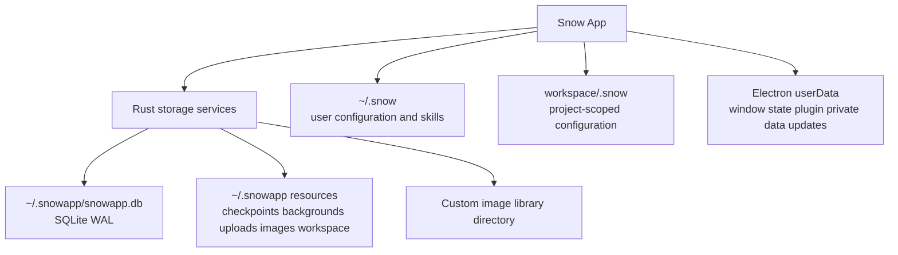
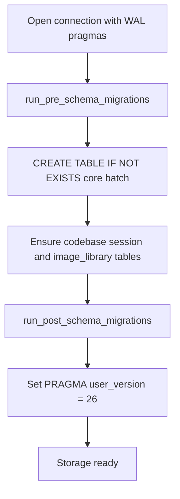
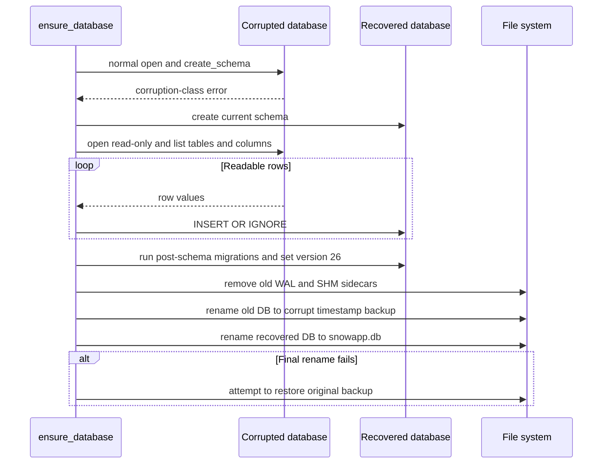
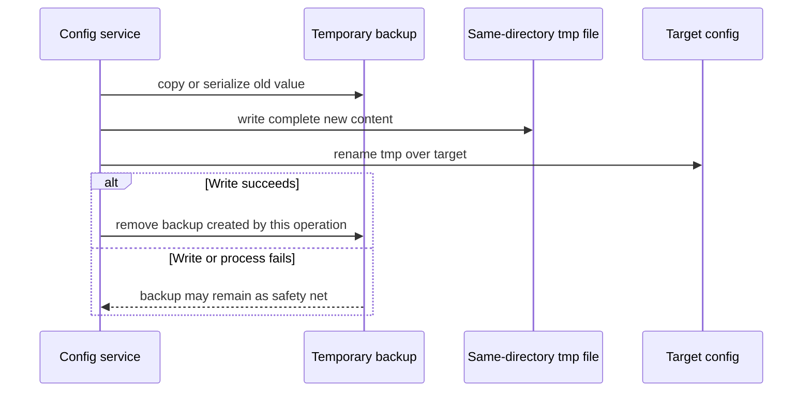
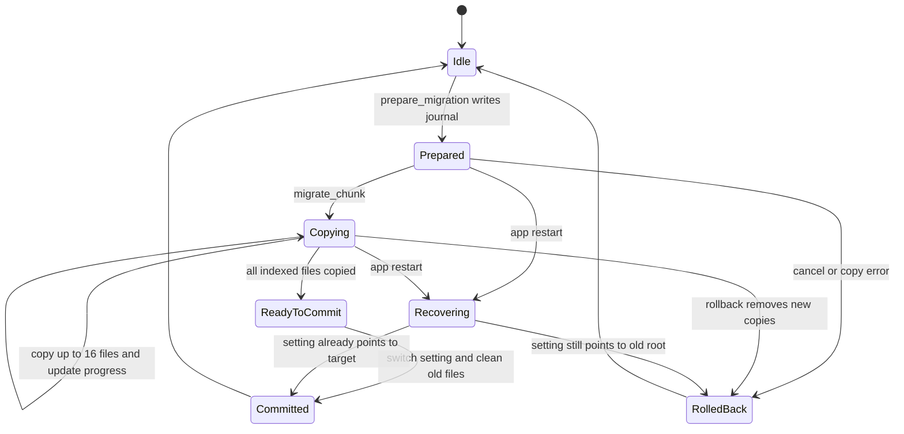
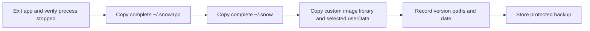

# 存储、迁移、备份与恢复

> 本文覆盖 Snow App 的持久化域、SQLite schema 生命周期、容错恢复、配置原子写和图像库目录迁移。项目当前没有已确认的一键完整备份/恢复 API；相关章节描述的是离线运维流程。

## 1. 存储域组件图

不要把所有数据笼统描述为位于 `~/.snowapp`。具体路径由 `native/src/storage/paths.rs`、Electron `app.getPath("userData")` 和 workspace scope 共同决定。

## 2. 持久化位置

| 域 | 典型内容 | 说明 |
|---|---|---|
| `~/.snowapp/` | `snowapp.db`、`checkpoints/`、`backgrounds/`、`stream-cursors/`、`upload/<date>/`、默认 `image/`、内置 `workspace/` | 应用数据和默认资源根 |
| `~/.snow/` | 设置 JSON、Skills、文档、`ROLE.md`、临时 `.config-backups/` | CLI/Agent 可见配置域 |
| `<workspace>/.snow/` | 项目级 MCP、权限、Hooks、子代理或索引相关状态 | 随 workspace 隔离 |
| Electron `userData` | `window-state.json`、`plugins/<hash>/`、更新缓存等 | 主进程和插件私有数据 |
| 自定义图库目录 | `image/...` 文件 | 数据库仍保存索引和相对路径 |

SSH 凭据和平台安全存储可能位于操作系统或 Electron 管理的位置；备份前应按敏感凭据处理。

## 3. SQLite WAL 与连接规则

`native/src/storage/database.rs::open_connection` 对每个服务连接统一设置：

- `PRAGMA foreign_keys = ON`
- `busy_timeout = 5s`
- `journal_mode = WAL`
- `synchronous = NORMAL`

WAL 允许多个 reader 与一个 writer 并行，5 秒 busy timeout 减少并发 `spawn_blocking` 写入立即失败。所有服务应复用 `open_connection`，而不是自行 `Connection::open` 后遗漏 pragma。

运行时 `snowapp.db-wal` 可能包含尚未 checkpoint 到主文件的已提交事务。因此，**应用运行时只复制 `snowapp.db` 不是一致性备份**。最简单安全的方法是完全退出应用后复制整个数据目录。

## 4. Schema 与 user_version

`create_schema` 当前流程直接建立 20 张表，再由 `image_library::ensure_image_library_table` 建立图像库表，总计 **21 张核心业务表（含 `image_library`）**。`codebase_embed_sessions` 等辅助表和代码库索引的按项目动态表不属于这 21 张直接核心表。

当前 `PRAGMA user_version = 26`。新增表应进入当前 schema；新增列/索引或兼容旧结构的转换进入迁移；每个迁移必须幂等，完成后提升 `user_version`。不要手工编辑数据库文件或直接修改 `user_version` 来跳过迁移。

## 5. 两阶段迁移

- **Pre-schema** 在建表批次前运行，适合旧结构会阻碍当前 schema 的重建迁移。例如旧 INTEGER 主键表需要先处理。
- **Post-schema** 在当前表存在后运行，适合幂等新增列、索引、表重建补齐和数据清理。
- 新数据库和已升级数据库都可能重复经过这些函数，所以成功迁移必须再次执行仍为安全 no-op。

迁移失败会阻止 storage ready；调用方不应在 schema 未完成时绕过 `storageReady` 门控继续普通业务访问。

## 6. 损坏检测与自动恢复

正常启动先尝试 `open_connection` 与 `create_schema`。只有 SQLite 主错误码为 `DatabaseCorrupt`、`NotADatabase`，或消息符合 `malformed` / `not a database` 时才调用恢复；应用不会在每次启动无条件运行 `quick_check` 或 `integrity_check`。

无法读取的行会跳过并记录，因此自动恢复是**尽力恢复而非无损恢复**。保留 `snowapp.db.corrupt.<timestamp>.bak`，用于后续人工取证或更专业的 SQLite 恢复。不要用 recovered 文件覆盖这份备份。

## 7. 配置原子写与临时备份

`native/src/mcp/servers/config.rs` 的 file-backed 配置写入使用同目录临时文件和 rename；写入前把旧文件复制到 `~/.snow/.config-backups/<file>.<timestamp>.bak`。DB-backed config 也会把旧值序列化为临时 `.bak`。`ROLE.md` 走独立 `atomic_write_role`，仍遵循 tmp + rename。

`.config-backups` 是写入期间的临时安全网，**不是长期备份仓库**。代码会限制每文件遗留备份数量，但正常成功写入会立即清理本次备份。长期备份必须另行复制完整配置域。

## 8. 图像库目录迁移

更换图库根目录采用 journal 驱动的复制提交，而不是直接移动：

`prepare_migration` 校验新旧根关系、读取 `image_library` 相对路径并写 journal，原文件不删除。UI 每次通过 `migrate_chunk(16)` 最多复制 16 个文件并更新进度。`commit_migration` 先补迁迁移期间新增图片，再将 `system_settings.image_library_dir` 切到目标，此处是提交点，随后清理 journal 和旧文件。

`rollback_migration` 删除新根已复制副本、保留旧文件。存储初始化时 `recover_interrupted_migration` 检查设置是否已指向新根：已提交则完成旧文件清理，未提交则删除副本。损坏 journal 会被丢弃并记录。IPC 通道为 `images:library-migrate-prepare/chunk/commit/rollback`。

## 9. 一致性备份清单

推荐离线备份：

1. 完全退出 Snow App，并确认没有遗留应用进程。
2. 复制完整 `~/.snowapp/`，而不是只复制数据库主文件。
3. 复制完整 `~/.snow/`。
4. 若 `system_settings.image_library_dir` 指向自定义目录，单独复制该目录。
5. 如需保留插件私有数据，复制 `<userData>/plugins/`。
6. 按需要复制窗口状态、更新缓存或 SSH 相关数据；凭据必须加密保存并限制访问。
7. 记录应用版本、操作系统和自定义路径，方便恢复时判断兼容性。

如果业务要求运行时在线备份，应实现 SQLite backup API 或受控 checkpoint 流程，而不是临时拼接主文件、WAL 和 SHM；当前未确认项目提供该功能。

## 10. 恢复步骤

1. 保持 Snow App 完全退出。
2. 先把当前 `~/.snowapp/`、`~/.snow/` 和相关自定义目录另存，避免覆盖唯一可用副本。
3. 恢复完整目录集合；不要只替换 `snowapp.db` 而留下不匹配的 `-wal` / `-shm`。
4. 恢复自定义图像库及所需插件私有数据。
5. 启动 Snow App，让当前版本自动执行幂等 schema migration。
6. 检查应用日志、关键会话、设置、图片和 workspace 绑定。
7. 若出现自动损坏恢复，保留 `.corrupt.*.bak` 并核查是否有行丢失。

从旧版本数据恢复到新版本可让向前迁移执行；把新版本数据库直接交给旧版本没有兼容保证。跨机器恢复还需重新验证绝对路径、SSH 凭据和操作系统特定配置。

## 11. 失败场景与禁忌

| 场景 | 正确处理 |
|---|---|
| 运行中只复制 `snowapp.db` | 停止应用后复制完整目录，或未来使用正式 SQLite backup API |
| 手改 `user_version` | 恢复备份并让迁移代码执行 |
| 自动恢复后数据不全 | 保留 corrupt 备份，比较日志并做人工恢复 |
| 配置写入中断 | 检查目标、tmp 和 `.config-backups` 遗留，不把目录当长期版本库 |
| 图库迁移中断 | 下次初始化让 journal recovery 判定提交或回滚 |
| 新库降级给旧应用 | 使用匹配版本或先验证兼容性，不能假设可逆迁移 |

## 12. 源码锚点

| 主题 | 文件或函数 |
|---|---|
| 路径解析 | `native/src/storage/paths.rs` |
| 连接、schema、损坏恢复 | `native/src/storage/database.rs` |
| pre/post migration | `native/src/storage/migrations.rs` |
| 初始化与中断迁移恢复 | `native/src/storage/mod.rs` |
| 图像库迁移 | `native/src/storage/services/image_library.rs` |
| 图像库 IPC | `src/main/ipc/handlers/imageLibraryHandlers.ts`、`src/preload/modules/imageLibraryApi.ts` |
| 配置备份和原子写 | `native/src/mcp/servers/config.rs` |
| 会话与 checkpoint | `native/src/storage/services/chat_conversations.rs`、`checkpoint.rs` |
