# 功能模块架构与数据流图集

> 本图集按功能拆分可维护的 Mermaid 源码。图中只保留稳定边界；实现变化时，应同时更新“维护说明”和源码锚点，而不是把所有内部函数塞进一张巨图。

## 1. 聊天与会话

**用途与边界**：Renderer 管理消息 UI、每会话 Agent loop 和流状态；Rust 规范化 provider 请求、解析流并持久化模型交换。

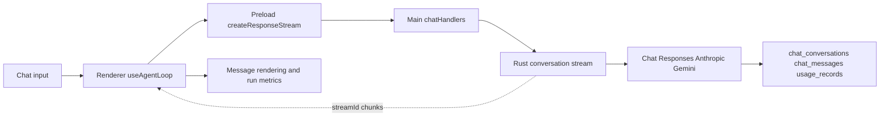

**维护说明**：不要把 `sessionProxy.ts` 画进 AI 流；工具结果由 Renderer 生成 `toolResultsJson` 后进入下一模型轮次。

**源码锚点**：`src/renderer/components/mainContent/chatMessages/hooks/useAgentLoop.ts`、`src/preload/modules/apiConfigApi.ts`、`src/main/ipc/handlers/chatHandlers.ts`、`native/src/api/conversation/stream.rs`、`native/src/storage/services/chat_conversations.rs`。

## 2. MCP 工具发现与调用

**用途与边界**：Rust 生成模型可见工具集合并执行工具；Renderer 负责用户授权和调用轮次，不负责绕过 Rust 策略。

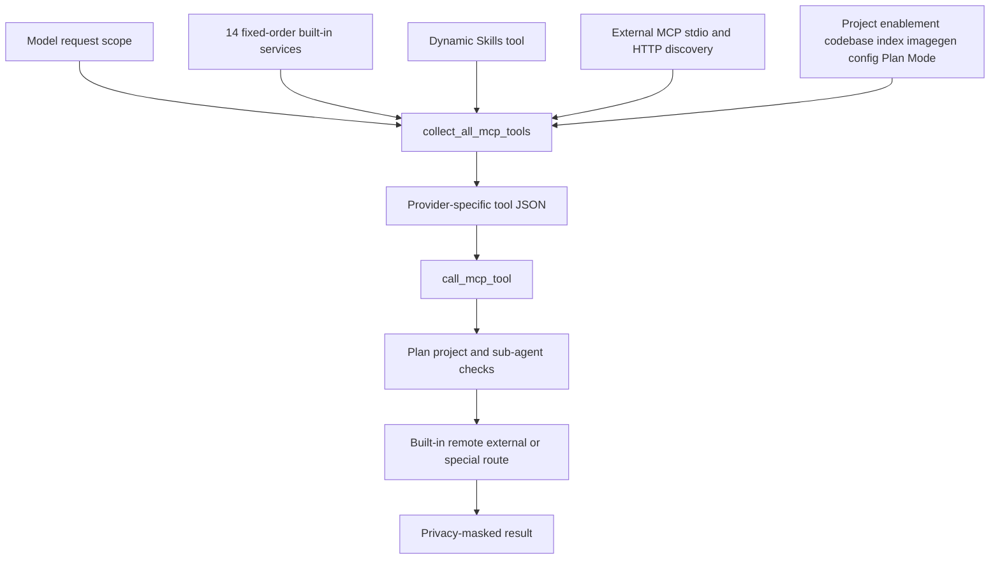

**维护说明**：固定服务必须追加到 `builtin_services_in_order` 末尾以保持 prompt cache；Skills 和 remote workspace 不计入 14 个固定服务。

**源码锚点**：`native/src/mcp/builtin.rs`、`native/src/mcp/tools.rs`、`native/src/mcp/service.rs`、`native/src/mcp/external/`、`native/src/mcp/privacy_mask.rs`。

## 3. Skills

**用途与边界**：Skills 配置按全局或项目 scope 管理，模型侧工具按请求动态注入；内置 Skills 和文档在启动时幂等同步到 `~/.snow/`。

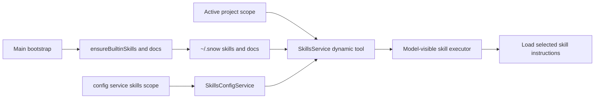

**维护说明**：`skills_config` 是 config 的 skills scope 委托，不是独立注册 MCP 服务；动态工具是否出现取决于 scope 和可用配置。

**源码锚点**：`src/main/app/ensureBuiltinSkills.ts`、`native/src/mcp/servers/skills.rs`、`native/src/mcp/servers/skills_config.rs`、`native/src/mcp/servers/config.rs`、`native/src/mcp/tools.rs`。

## 4. Hooks 与子代理

**用途与边界**：Hooks 为用户消息、工具、压缩和子代理生命周期提供可配置决策点；子代理是独立会话和 Renderer loop，但权限及 checkpoint 受父会话约束。

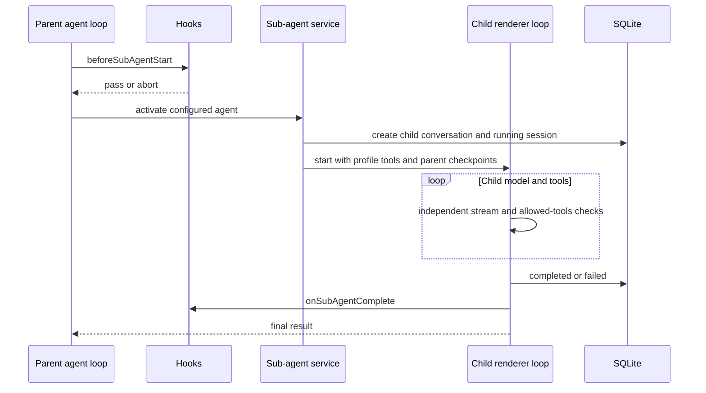

**维护说明**：工具 Hook 顺序是 `toolConfirmation` → 授权 → `beforeToolCall` → MCP → `afterToolCall`。父 abort 传播到子代理；启动时遗留 running 会话被取消。

**源码锚点**：`src/renderer/components/mainContent/chatMessages/hooks/subAgentActivation.ts`、`toolExecution.ts`、`useToolAuthorization.ts`、`hookOutcome.ts`、`native/src/hooks/`、`native/src/mcp/servers/sub_agents.rs`。

## 5. 图像生成与图库

**用途与边界**：imagegen MCP 依据独立 channel 配置调用 provider；生成结果写文件并登记图库，Renderer 将连续并行调用合并为画廊。

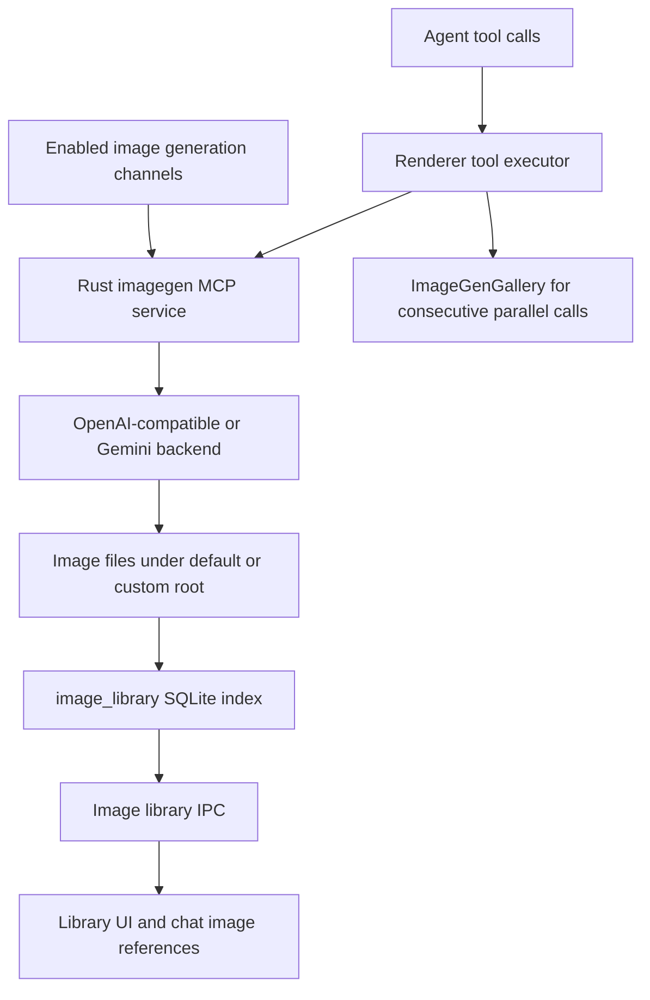

**维护说明**：工具只在至少一个 channel 启用时发现。并行多图是多次工具调用，Renderer 画廊负责统一网格；图库目录更换走 prepare/chunk/commit/rollback journal 流程。

**源码锚点**：`native/src/mcp/servers/imagegen.rs`、`src/main/ipc/handlers/imageHandlers.ts`、`native/src/storage/services/image_library.rs`、`native/src/exports/images.rs`、`src/main/ipc/handlers/imageLibraryHandlers.ts`。

## 6. 浏览器

**用途与边界**：Renderer webview 提供可视页面，Main 管理 Electron 网络记录、弹窗、密码和上下文菜单，Rust MCP browser 服务暴露模型工具。

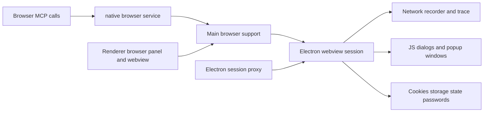

**维护说明**：`browserNetworkRecorder`、storage state 和 trace 是辅助模块，不是独立 IPC 注册组。OAuth popup 需要保留 `window.opener` 关系；网络代理由 `sessionProxy.ts` 应用到 Electron session。

**源码锚点**：`native/src/mcp/servers/browser.rs`、`src/main/ipc/handlers/browserNetworkRecorder.ts`、`browserStorageState.ts`、`browserTrace.ts`、`browserPasswordHandlers.ts`、`src/main/browser/browserPopupWindow.ts`、`src/main/app/sessionProxy.ts`。

## 7. 终端与 SSH

**用途与边界**：本地 PTY 和持久 terminal 工具由本地进程管理；SSH manager、远程命令和 remote workspace 适配远端文件、命令与 Git。

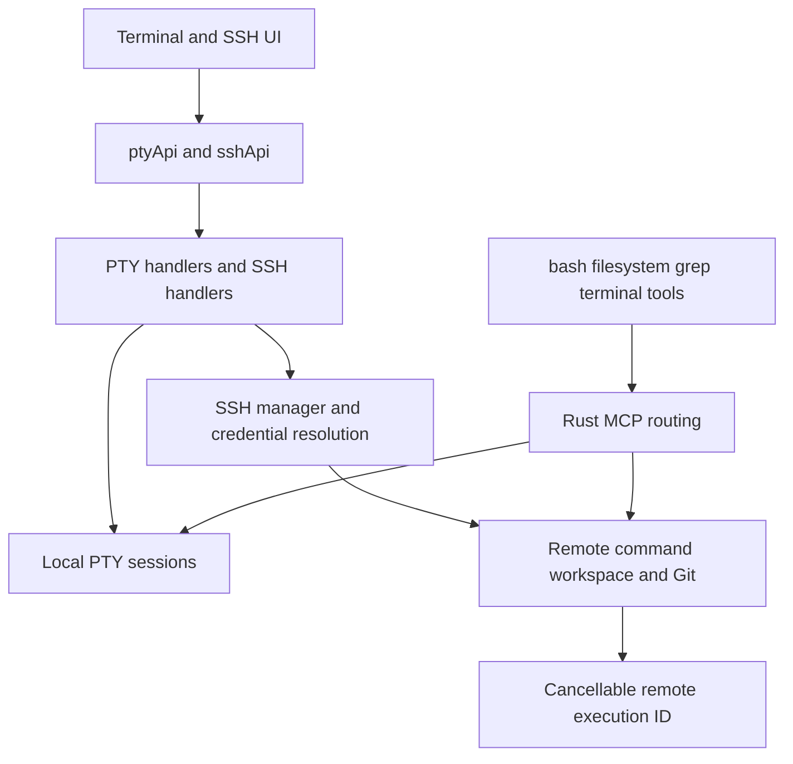

**维护说明**：terminal MCP 默认禁用，需项目显式开启。远程 workspace 是执行支撑，不应重复注册为固定内置服务；Windows/本地与 SSH 路径解析必须在路由前完成。

**源码锚点**：`src/main/pty/registerPtyHandlers.ts`、`src/main/ipc/handlers/sshHandlers.ts`、`src/main/ssh/sshManager.ts`、`remoteWorkspaceCommand.ts`、`remoteGit.ts`、`native/src/mcp/servers/terminal.rs`、`remote_workspace.rs`。

## 8. Git 与代码库索引

**用途与边界**：UI Git 经 Main 和 native export 调用本地或远程 Git；代码库索引由 Rust 构建 embedding/chunk，并仅在索引可用时向模型暴露搜索工具。

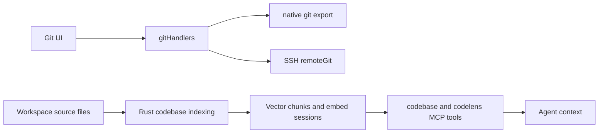

**维护说明**：Git UI 操作与模型工具授权是不同入口。codebase 工具要求有效 project、项目启用且已有 chunk；未建索引时应隐藏而不是返回空能力。

**源码锚点**：`src/main/ipc/handlers/gitHandlers.ts`、`src/main/ssh/remoteGit.ts`、`native/src/exports/git.rs`、`native/src/exports/codebase.rs`、`native/src/mcp/servers/codebase.rs`、`native/src/mcp/servers/codelens/`、`native/src/storage/services/codebase_embed_sessions.rs`。

## 9. 第三方导入与插件

**用途与边界**：Codex、Claude Code、OpenCode 可从本地、WSL 或 SSH 发现并选择性导入；目录变更与 SQLite 导入事务协调回滚。插件运行时使用受限 utility process。

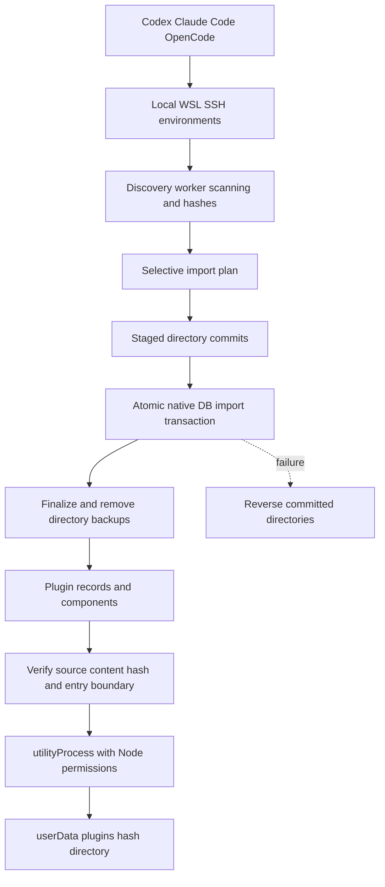

**维护说明**：`ImportExecutionPlan.commit` 先提交 staged 目录，再提交一次 native DB 事务；DB 失败则反向回滚目录。插件仅按声明授权 storage/network/child-process，源码 hash 变化要求重新扫描，退出时 `stopAll()`。

**源码锚点**：`src/main/codex/importer.ts`、`src/main/importConfig/importEnvironments.ts`、`discovery.ts`、`selectedImport.ts`、`directoryCommit.ts`、`importTransaction.ts`、`pluginManager.ts`、`src/main/plugins/pluginRuntimeManager.ts`、`plugin-runtime-worker.ts`。

## 10. 配置

**用途与边界**：配置跨 file-backed、DB-backed、全局和项目 scope；Renderer 通过 config API 或模型 config MCP 工具访问，Rust 统一验证、掩码、备份和写入。

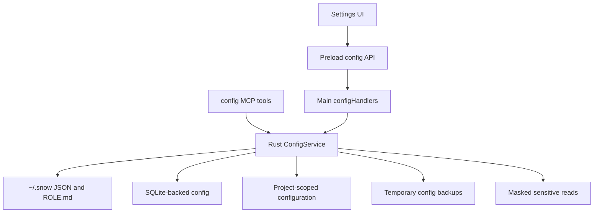

**维护说明**：文件写入采用同目录 tmp + rename；临时备份成功后清理。删除配置必须明确目标和影响；敏感字段读取保持掩码。skills scope 委托 SkillsConfigService。

**源码锚点**：`native/src/mcp/servers/config.rs`、`native/src/mcp/servers/skills_config.rs`、`src/preload/modules/configApi.ts`、`src/main/ipc/handlers/configHandlers.ts`、`src/main/settings/`。

## 11. 应用更新

**用途与边界**：更新器按平台分支；非 macOS 使用 electron-updater 的显式下载/安装状态机，macOS 使用独立检查与下载实现。更新网络遵循 updater 专用 Electron session 代理。

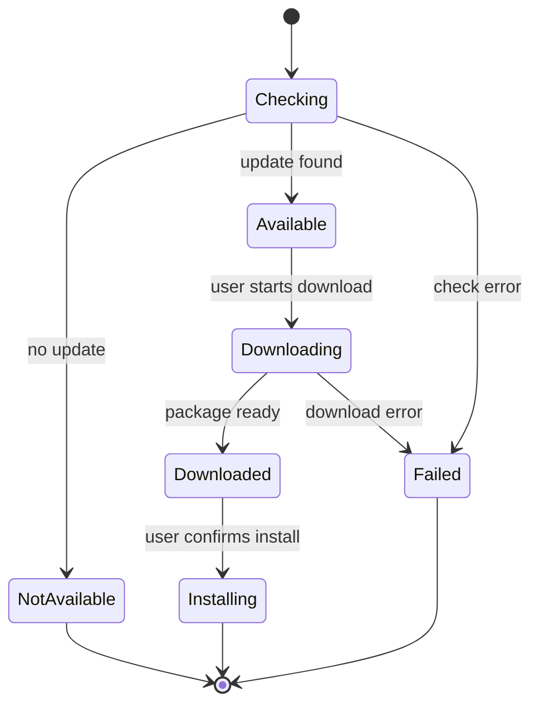

**维护说明**：非 macOS 禁止自动下载和退出自动安装；状态必须体现用户触发的下载与安装。macOS 下载缓存位于 userData updates 相关目录。default session 与 updater partition 都通过 `applySessionProxy`。

**源码锚点**：`src/main/updater/autoUpdater.ts`、`electronUpdater.ts`、`macUpdater.ts`、`updateStatus.ts`、`src/main/app/mainWindow.ts`、`src/main/app/sessionProxy.ts`。
